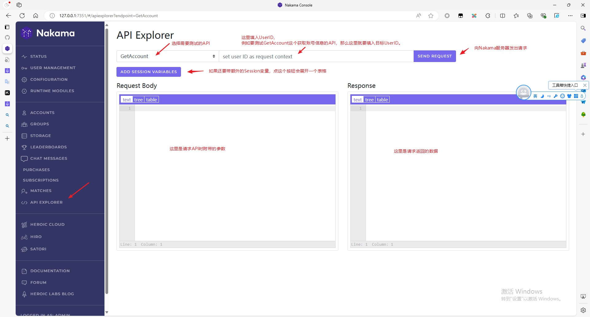
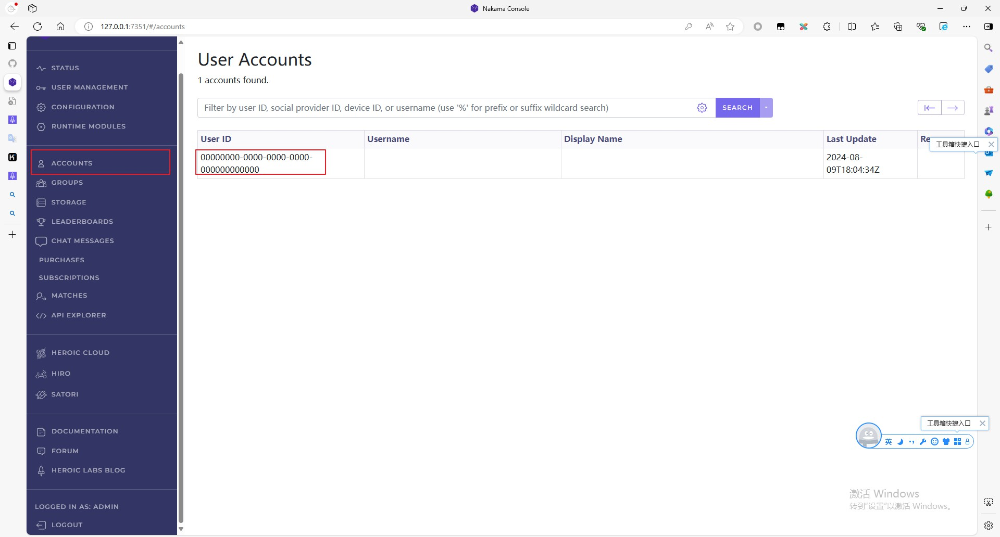
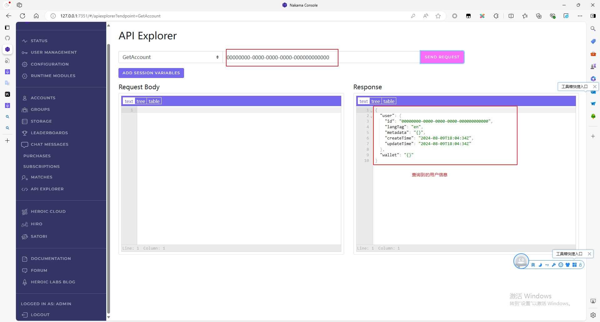

## API Explorer

高危操作 ！！！
高危操作 ！！！
高危操作 ！！！

API Explorer中执行的是高危操作
运用于正式环境，请求执行的按钮，一定要加二次确认弹窗+验证码，再执行！！！

在Nakama Web后台左侧切换到`API Explorer`就可以打开了。

官方文档：`https://heroiclabs.com/docs/nakama/getting-started/console/api-explorer/`

`API Explorer`主要用来调用执行Nakama内置的一些API，无法调用自定义的RPC。

下面是一个通过`GetAccount`这个API，来查询账号信息的例子。

在后台的Account里能看到账号列表，Nakama默认创建了一个账号。

复制这个UserID，填到`API Explorer`的UserID框里。

点击请求，就可以查询到这个账号的信息。

