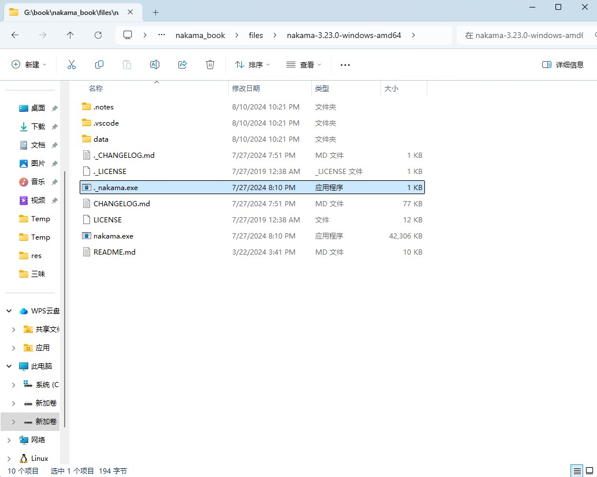

## 安装Nakama服务器

本章介绍如何安装Nakama+PostgreSQL数据库。

PostgreSQL数据库仅作为开发环境使用，不能用于线上正式环境。

本篇章仅供学习Nakama使用，正式环境请参照官方文档使用CockroachDB替代PostgreSQL。

而由于CockroachDB没有Windows版本，所以正式环境下是Nakama(Win/Linux)+CockroachDB(Linux)。

为了方便学习使用，仓库自带了Nakama程序，在`./files/nakama-3.23.0-windows-amd64`目录中，后续只需安装好PostgreSQL即可。

