## 在Windows安装Nakama服务器

参考官方文档：`https://heroiclabs.com/docs/nakama/getting-started/install/windows/`


### 1. 安装Nakama

下载地址：`https://github.com/heroiclabs/nakama/releases`

选择最新版本下载就行，我此时是 3.23.0。

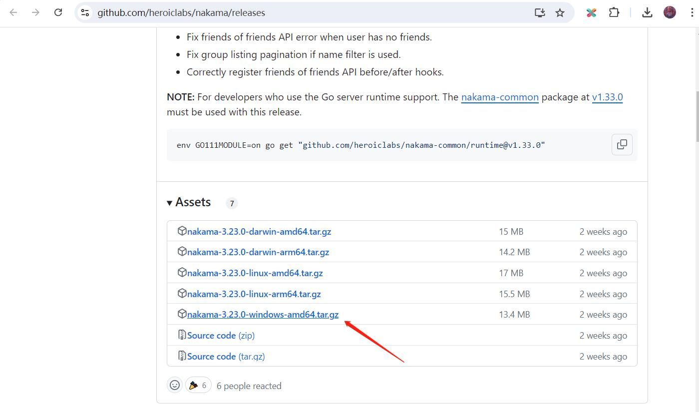

在文件夹按住shift+鼠标右键，选择`在此处打开PowerShell窗口`。

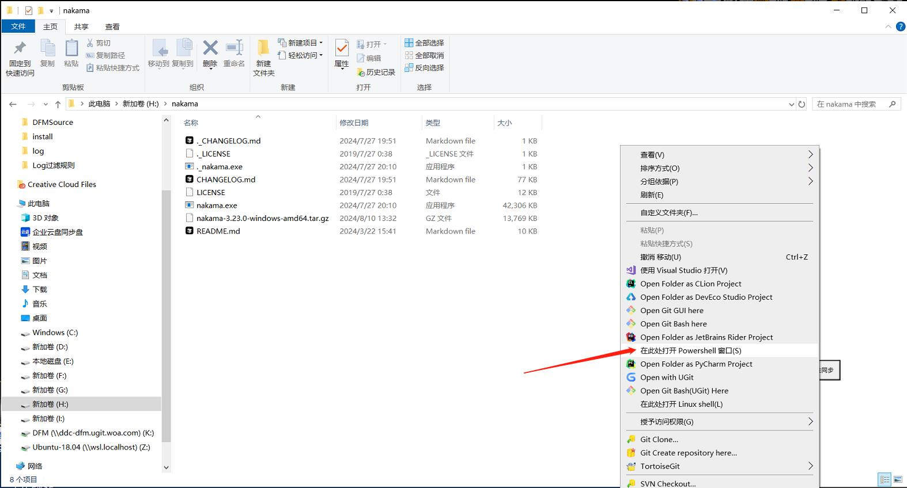

输入命令`tar -zxvf .\nakama-3.23.0-windows-amd64.tar.gz` 解压。

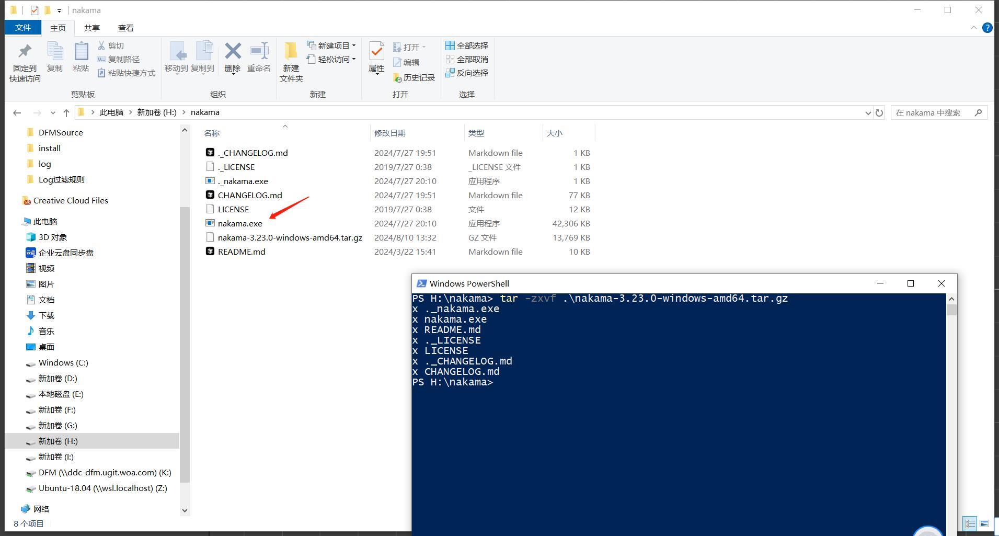


Nakama实验性支持PostgreSQL数据库，正式环境仅支持CockroachDB数据库(CockroachDB是原生分布式数据库)。

推荐使用CockroachDB数据库。

在Windows平台CockroachDB仅作为开发使用，正式环境需要在Linux平台上部署。

需要注意的是，从`v23`开始，CockroachDB需要企业授权，程序内置监控，没有授权码会限制流量，可以每年到官网申请免费授权。

本文使用`v22`版本进行学习开发，旧版本免费，但官方不再维护。

下面分别介绍两种数据库的使用方式。

### 2. 使用PostgreSQL

#### 2.1 安装PostgreSQL

下载地址：`https://www.enterprisedb.com/downloads/postgres-postgresql-downloads`

选择自己想要的版本，点击下载图标即可。

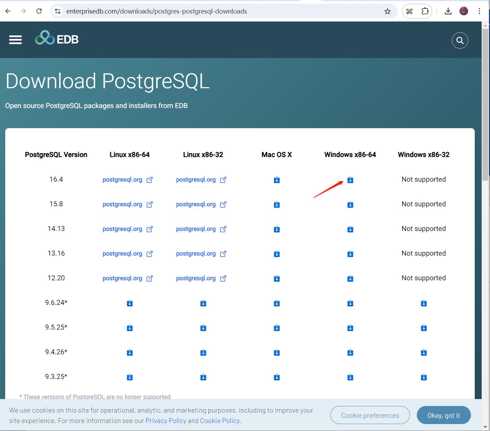

然后会跳转到下载页面，就会自动下载。

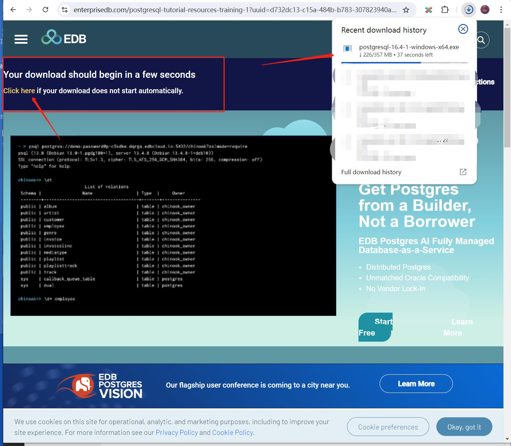

如果没有自动下载，就点击 `Click here` 手动下载。

下载好之后就开始安装，按照下面步骤。

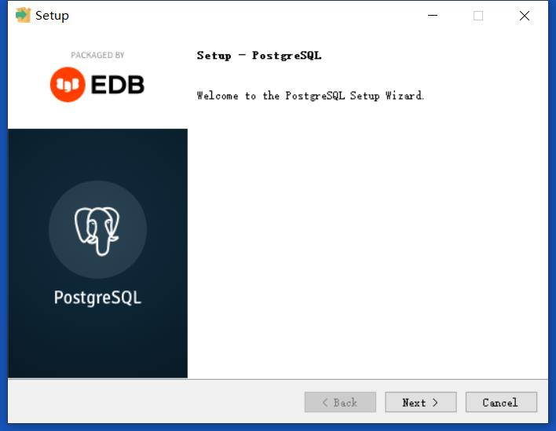

选择程序安装目录，这里就使用默认路径了。

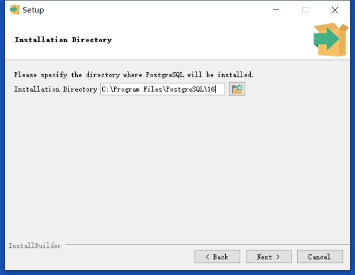

选择组件，按图中勾选。

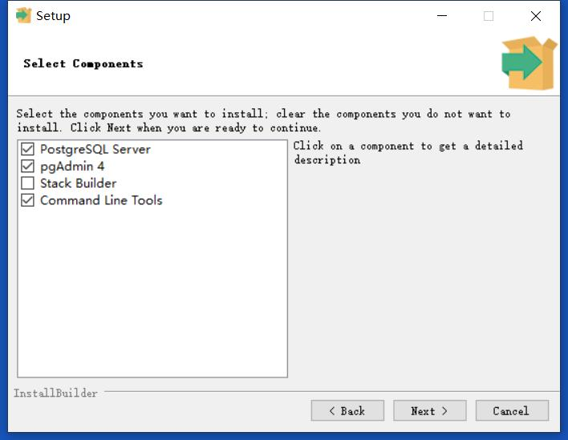

选择数据库保存目录，这里就使用默认路径了。

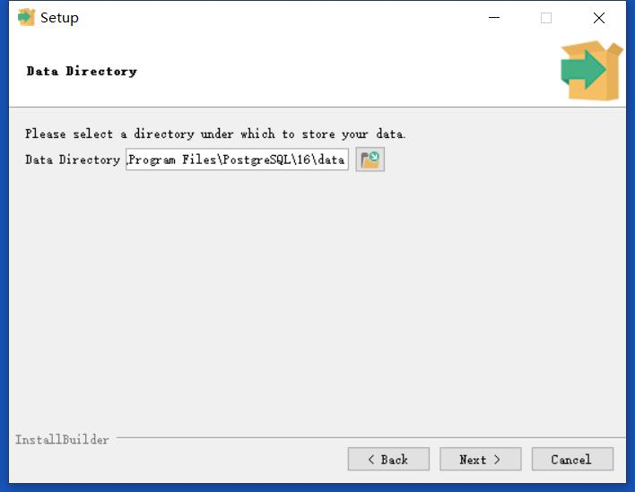

设置默认用户的密码，默认用户是`postgres`，这里密码就设置为`password`。

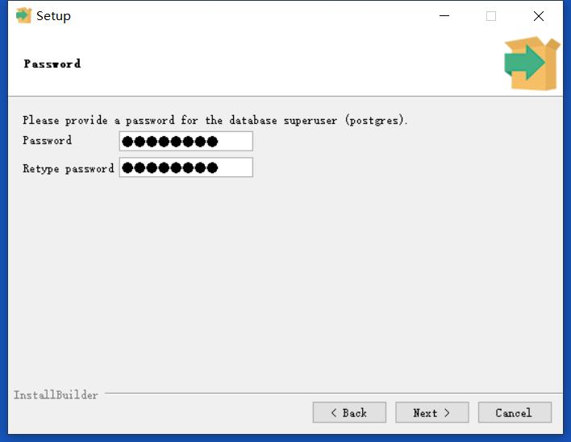

设置端口，用默认的。

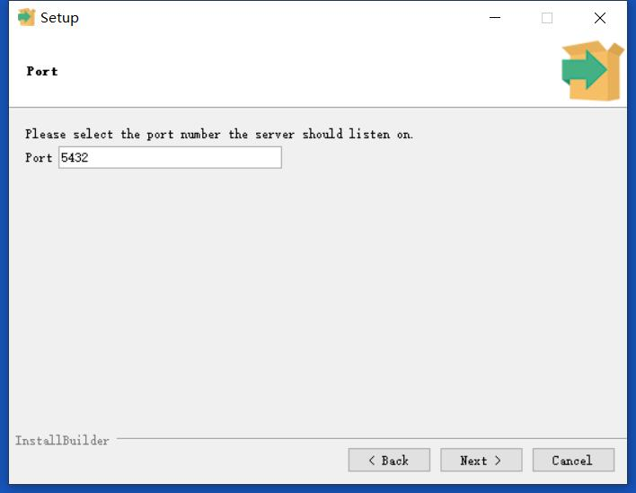

设置地区，也默认就行。

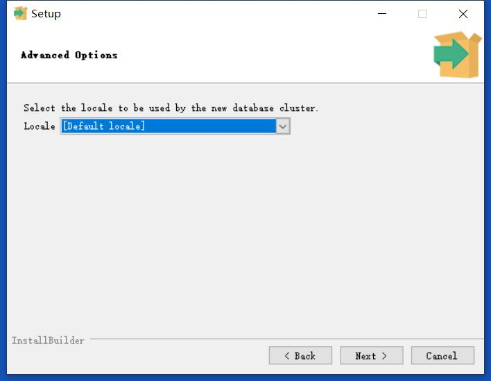

然后就一直下一步，等待安装完成。

#### 2.2. 同步数据库

现在刚安装好，需要往PostgreSql里创建一些数据库和表格才行。

Nakama提供了一个命令来自动创建数据库和表格。

在上面解压的PowerShell里继续执行命令:

`./nakama.exe migrate up --database.address postgres:password@127.0.0.1:5432`

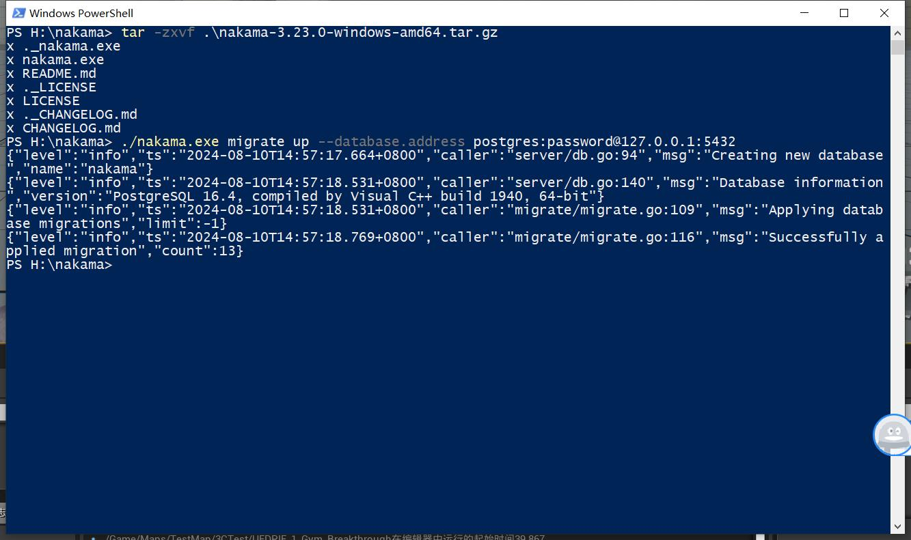

当看到最后输出`Successfully applied migration`时，说明数据库同步成功了。

#### 2.3. 启动服务器

使用批处理(run_nakama_postgresql.bat) 或 执行命令启动服务器：

`./nakama.exe --database.address postgres:password@127.0.0.1:5432`

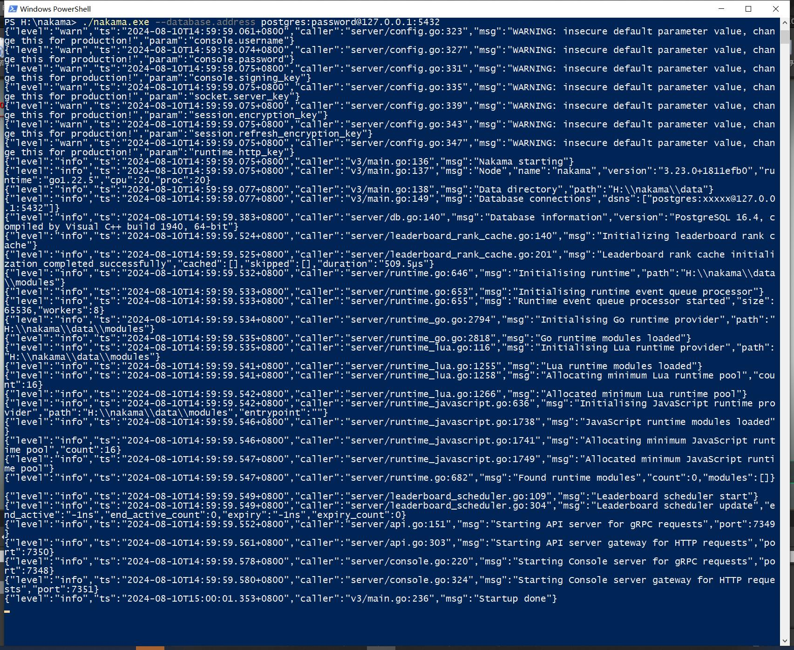

看到`Startup done` 说明启动成功了。

中间如果出现了Windows防火墙，记得允许通过。

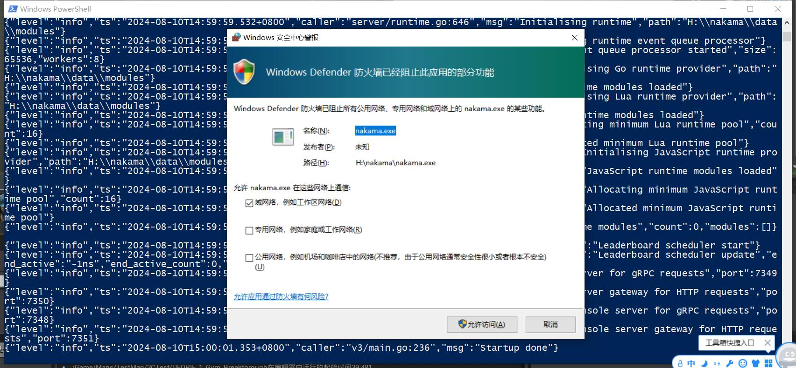

### 3. 使用CockroachDB

这里准备了一系列PowerShell脚本，方便后续使用。

#### 3.1 安装CockroachDB

打开PowerShell，切换到目录`nakama_book\files\cockroachdb`,执行`./cockroachdb-download.ps1` 下载并安装CockroachDB。

#### 3.2 启动CockroachDB集群

打开PowerShell，切换到目录`nakama_book\files\cockroachdb`,执行`./start-windows-cluster.ps1`启动3个节点的集群。

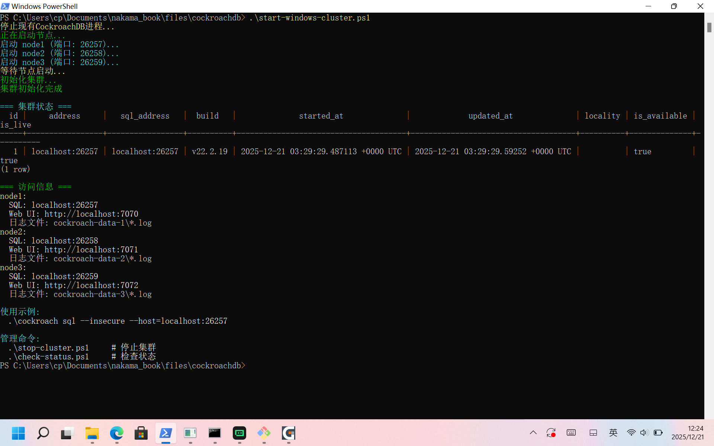

CockroachDB内置了Bench工具，执行命令` .\cockroach.exe workload init tpcc --warehouses=10 --drop` 可以向数据库插入大量数据。

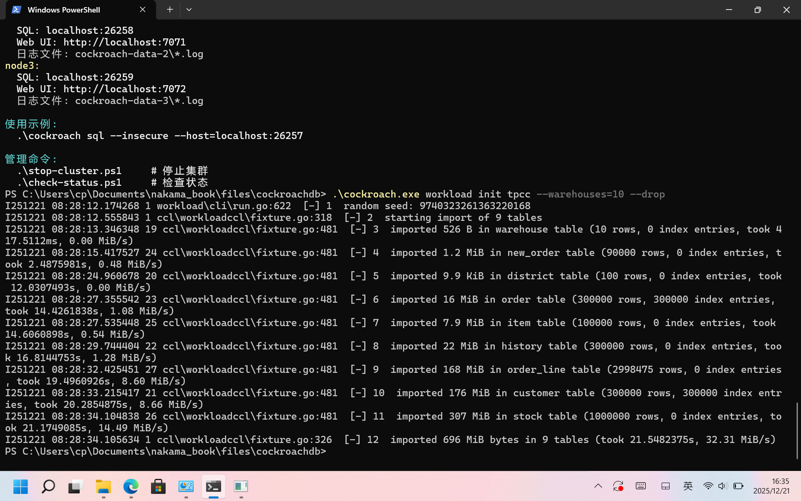

然后在后台可以查看DB状态以及性能热点。

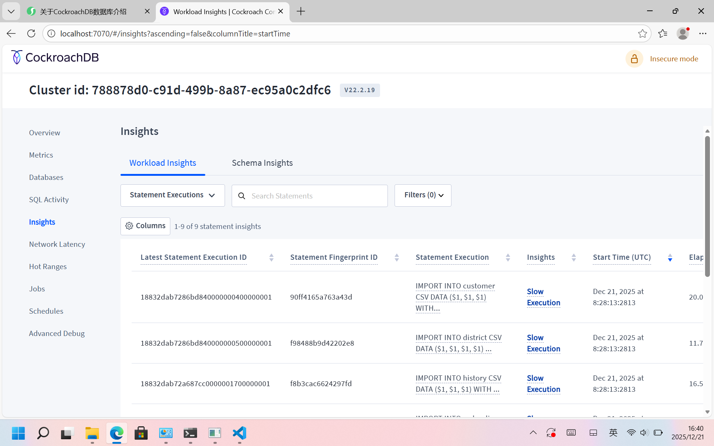

还有其他应用类型的bench测试，输入命令` .\cockroach.exe workload init`查看。

```txt
bank         # 模拟银行转账场景
movr         # 模拟移动应用（共享单车/汽车）
tpcc         # TPC-C基准测试（订单处理系统）
tpch         # TPC-H基准测试（决策支持系统）
kv           # 简单的键值操作
ycsb         # Yahoo! Cloud Serving Benchmark
startrek     # Star Trek数据集
intro        # 入门示例
```

然后可以用命令连接，用标准Sql语法查看DB数据。

```shell
PS C:\Users\cp\Documents\nakama_book\files\cockroachdb> ./cockroach sql --insecure --host=localhost:26257
#
# Welcome to the CockroachDB SQL shell.
# All statements must be terminated by a semicolon.
# To exit, type: \q.
#
# Server version: CockroachDB CCL v22.2.19 (x86_64-w64-mingw32, built 2024/02/26 16:36:47, go1.19.6) (same version as client)
# Cluster ID: 788878d0-c91d-499b-8a87-ec95a0c2dfc6
#
# Enter \? for a brief introduction.
#
root@localhost:26257/defaultdb> show databases;
  database_name | owner | primary_region | secondary_region | regions | survival_goal
----------------+-------+----------------+------------------+---------+----------------
  defaultdb     | root  | NULL           | NULL             | {}      | NULL
  postgres      | root  | NULL           | NULL             | {}      | NULL
  system        | node  | NULL           | NULL             | {}      | NULL
  tpcc          | root  | NULL           | NULL             | {}      | NULL
(4 rows)


Time: 9ms total (execution 8ms / network 1ms)

root@localhost:26257/defaultdb> use tpcc;
SET


Time: 1ms total (execution 1ms / network 0ms)

root@localhost:26257/tpcc> show tables;
  schema_name | table_name | type  | owner | estimated_row_count | locality
--------------+------------+-------+-------+---------------------+-----------
  public      | customer   | table | root  |              300000 | NULL
  public      | district   | table | root  |                 100 | NULL
  public      | history    | table | root  |              300000 | NULL
  public      | item       | table | root  |              100000 | NULL
  public      | new_order  | table | root  |               90000 | NULL
  public      | order      | table | root  |              300000 | NULL
  public      | order_line | table | root  |             2998475 | NULL
  public      | stock      | table | root  |             1000000 | NULL
  public      | warehouse  | table | root  |                  10 | NULL
(9 rows)


Time: 46ms total (execution 45ms / network 1ms)

root@localhost:26257/tpcc> select * from customer limit 10;
  c_id | c_d_id | c_w_id |     c_first      | c_middle |   c_last    |      c_street_1      |     c_street_2     |        c_city        | c_state |   c_zip   |     c_phone      |       c_since       | c_credit | c_credit_lim | c_discount | c_balance | c_ytd_payment | c_payment_cnt | c_delivery_cnt |                                                                                                                                                                                                                                                  c_data
-------+--------+--------+------------------+----------+-------------+----------------------+--------------------+----------------------+---------+-----------+------------------+---------------------+----------+--------------+------------+-----------+---------------+---------------+----------------+------------------------------------------------------------------------------------------------------------------------------------------------------------------------------------------------------------------------------------------------------------------------------------------------------------------------------------------------------------------------------------------------------------------------------------------------------------------------------------------------------------
     1 |      1 |      0 | eufZbUD5         | OE       | BARBARBAR   | Ly942ccmlM9riA       | SNh8Q9d4DMqzCKV    | DO8vIZK7W8IMbt       | XC      | 777411111 | 3449718085813161 | 2006-01-02 15:04:05 | GC       |     50000.00 |     0.2693 |    -10.00 |         10.00 |             1 |              0 | jnD6xRRXDa43Iz7J0DkO4qRq63T6jGzwWcoaCdIygGIWREWrrkeNvd2DMxTnFgDFzvsAJdhQwPzbMGjiHqNB0uKv7s10nRusg13QDUlgHtZs6qDh6byxnP7ECAxWEIgKRE0a5U47tRsOmrjnuiOYQpxP8NkrpujnUr5pzFEYkm5r2V9ZxCvjXnCrRk4IyjONECVMhY5jJLSv3wF1bqJkUT9aDKtd9ryB724wjo9ru9dbRnJvmS7ObIcmgB2X1sci1BfkEybJkjrze6Iqx38LVPAgormlCacdUN1EEp6UFhh6udiG8LypPnXjGCGqnFOjM8IwWfnmGWTfD6WZksktgxcQx2JzL0rHxMxxmkkCSyUv6Z24sXcOUhZTa89U6P5gQCuGQ3AhZuwKXvsizF9Odj29V6ndG88WuUagdt40rwaX250vpPeTRQwarSpuH58twNr0Mptk08sCu91MPNmhu3Xivis
     2 |      1 |      0 | 99kjAX4eoA5LFp3  | OE       | BARBAROUGHT | HIajDmYec4P3sP       | KkFTva1J19xe9o     | FeUouHeufZbUD5Ly9    | DB      | 743411111 | 4971808581316137 | 2006-01-02 15:04:05 | GC       |     50000.00 |     0.0355 |    -10.00 |         10.00 |             1 |              0 | 42ccmlM9riASNh8Q9d4DMqzCKVDO8vIZK7W8IMbtjnD6xRRXDa43Iz7J0DkO4qRq63T6jGzwWcoaCdIygGIWREWrrkeNvd2DMxTnFgDFzvsAJdhQwPzbMGjiHqNB0uKv7s10nRusg13QDUlgHtZs6qDh6byxnP7ECAxWEIgKRE0a5U47tRsOmrjnuiOYQpxP8NkrpujnUr5pzFEYkm5r2V9ZxCvjXnCrRk4IyjONECVMhY5jJLSv3wF1bqJkUT9aDKtd9ryB724wjo9ru9dbRnJvmS7ObIcmgB2X1sci1BfkEybJkjrze6Iqx38LVPAgormlCacdUN1EEp6UFhh6udiG8LypPnXjGCGqnFOjM8IwWfnmGWTfD6WZksktgxcQx2JzL0rHxMxxmkkCSyUv6Z24sXcOUhZTa89U6P5gQCuGQ3AhZuw
     3 |      1 |      0 | eUouHeufZbUD5Ly9 | OE       | BARBARABLE  | 42ccmlM9riASNh8Q9d4  | DMqzCKVDO8vI       | ZK7W8IMbtjnD6xR      | LV      | 449711111 | 1808581316137748 | 2006-01-02 15:04:05 | GC       |     50000.00 |     0.2514 |    -10.00 |         10.00 |             1 |              0 | RXDa43Iz7J0DkO4qRq63T6jGzwWcoaCdIygGIWREWrrkeNvd2DMxTnFgDFzvsAJdhQwPzbMGjiHqNB0uKv7s10nRusg13QDUlgHtZs6qDh6byxnP7ECAxWEIgKRE0a5U47tRsOmrjnuiOYQpxP8NkrpujnUr5pzFEYkm5r2V9ZxCvjXnCrRk4IyjONECVMhY5jJLSv3wF1bqJkUT9aDKtd9ryB724wjo9ru9dbRnJvmS7ObIcmgB2X1sci1BfkEybJkjrze6Iqx38LVPAgormlCacdUN1EEp6UFhh6udiG8LypPnXjGCGqnFOjM8IwWfnmGWTfD6WZksktgxcQx2JzL0rHxMxxmkkCSyUv6Z24sXcOUhZTa89U6P5gQCuGQ3AhZuwKXvs
     4 |      1 |      0 | p3HIajDmYec      | OE       | BARBARPRI   | 4P3sPKkFTva1J1       | 9xe9oFeUouHeu      | fZbUD5Ly942ccmlM     | XP      | 774311111 | 4497180858131613 | 2006-01-02 15:04:05 | BC       |     50000.00 |     0.3444 |    -10.00 |         10.00 |             1 |              0 | 9riASNh8Q9d4DMqzCKVDO8vIZK7W8IMbtjnD6xRRXDa43Iz7J0DkO4qRq63T6jGzwWcoaCdIygGIWREWrrkeNvd2DMxTnFgDFzvsAJdhQwPzbMGjiHqNB0uKv7s10nRusg13QDUlgHtZs6qDh6byxnP7ECAxWEIgKRE0a5U47tRsOmrjnuiOYQpxP8NkrpujnUr5pzFEYkm5r2V9ZxCvjXnCrRk4IyjONECVMhY5jJLSv3wF1bqJkUT9aDKtd9ryB724wjo9ru9dbRnJvmS7ObIcmgB2X1sci1BfkEybJkjrze6Iqx38LVPAgormlCacdUN1EEp6UFhh6
     5 |      1 |      0 | PKkFTva1J        | OE       | BARBARPRES  | 19xe9oFeUouHeuf      | ZbUD5Ly942ccmlM9ri | ASNh8Q9d4DMq         | VZ      | 449711111 | 1808581316137748 | 2006-01-02 15:04:05 | GC       |     50000.00 |     0.3137 |    -10.00 |         10.00 |             1 |              0 | zCKVDO8vIZK7W8IMbtjnD6xRRXDa43Iz7J0DkO4qRq63T6jGzwWcoaCdIygGIWREWrrkeNvd2DMxTnFgDFzvsAJdhQwPzbMGjiHqNB0uKv7s10nRusg13QDUlgHtZs6qDh6byxnP7ECAxWEIgKRE0a5U47tRsOmrjnuiOYQpxP8NkrpujnUr5pzFEYkm5r2V9ZxCvjXnCrRk4IyjONECVMhY5jJLSv3wF1bqJkUT9aDKtd9ryB724wjo9ru9dbRnJvmS7ObIcmgB2X1sci1BfkEybJkjrze6Iqx38LVPAgormlCacdUN1EEp6UFhh6udiG8LypPnXjGCGqnFOjM8IwWfnmGWTfD6WZksktgxcQx2JzL0rHxMxxmkkCSyUv6Z24sXcOUhZTa8
     6 |      1 |      0 | ZbUD5Ly942c      | OE       | BARBARESE   | cmlM9riASNh8Q9d4DMqz | CKVDO8vIZK7W8IMbtj | nD6xRRXDa43Iz7       | ZX      | 743411111 | 4971808581316137 | 2006-01-02 15:04:05 | GC       |     50000.00 |     0.2889 |    -10.00 |         10.00 |             1 |              0 | J0DkO4qRq63T6jGzwWcoaCdIygGIWREWrrkeNvd2DMxTnFgDFzvsAJdhQwPzbMGjiHqNB0uKv7s10nRusg13QDUlgHtZs6qDh6byxnP7ECAxWEIgKRE0a5U47tRsOmrjnuiOYQpxP8NkrpujnUr5pzFEYkm5r2V9ZxCvjXnCrRk4IyjONECVMhY5jJLSv3wF1bqJkUT9aDKtd9ryB724wjo9ru9dbRnJvmS7ObIcmgB2X1sci1BfkEybJkjrze6Iqx38LVPAgormlCacdUN1EEp6UFhh6udiG8LypPnXjGCGqnFOjM8IwWfnmGWTfD6WZksktgxcQx2JzL0rHxMxxmkkCSyUv6Z24sXcOUhZTa89U6P5gQCuGQ3AhZuwKXvsizF9Odj29V6ndG88WuUagdt40rwaX250vpPeTRQwarSpuH58twNr0Mptk08sCu91MPNmhu3XivishG74GTnfPOJmgM6APd4Ez71egUWe7
     7 |      1 |      0 | 19xe9oFeUouHeuf  | OE       | BARBARANTI  | ZbUD5Ly942c          | cmlM9riASNh8Q9     | d4DMqzCKVD           | ID      | 743411111 | 4971808581316137 | 2006-01-02 15:04:05 | BC       |     50000.00 |     0.4761 |    -10.00 |         10.00 |             1 |              0 | O8vIZK7W8IMbtjnD6xRRXDa43Iz7J0DkO4qRq63T6jGzwWcoaCdIygGIWREWrrkeNvd2DMxTnFgDFzvsAJdhQwPzbMGjiHqNB0uKv7s10nRusg13QDUlgHtZs6qDh6byxnP7ECAxWEIgKRE0a5U47tRsOmrjnuiOYQpxP8NkrpujnUr5pzFEYkm5r2V9ZxCvjXnCrRk4IyjONECVMhY5jJLSv3wF1bqJkUT9aDKtd9ryB724wjo9ru9dbRnJvmS7ObIcmgB2X1sci1BfkEybJkjrze6Iqx38LVPAgormlCacdUN1EEp6UFhh
     8 |      1 |      0 | Tva1J19xe9oFeU   | OE       | BARBARCALLY | ouHeufZbUD5Ly942c    | cmlM9riASNh8Q9d4D  | MqzCKVDO8vIZK7W8IMbt | PA      | 718011111 | 8581316137748625 | 2006-01-02 15:04:05 | GC       |     50000.00 |     0.2537 |    -10.00 |         10.00 |             1 |              0 | jnD6xRRXDa43Iz7J0DkO4qRq63T6jGzwWcoaCdIygGIWREWrrkeNvd2DMxTnFgDFzvsAJdhQwPzbMGjiHqNB0uKv7s10nRusg13QDUlgHtZs6qDh6byxnP7ECAxWEIgKRE0a5U47tRsOmrjnuiOYQpxP8NkrpujnUr5pzFEYkm5r2V9ZxCvjXnCrRk4IyjONECVMhY5jJLSv3wF1bqJkUT9aDKtd9ryB724wjo9ru9dbRnJvmS7ObIcmgB2X1sci1BfkEybJkjrze6Iqx38LVPAgormlCacdUN1EEp6UFhh6udiG8LypPnXjGCGqnFOjM8IwWfnmGWTfD6WZksktgxcQx2JzL0rHxMxxmkkCSyUv6Z24sXcOUhZTa89U6P5gQCuGQ3AhZuwKXvsizF9Odj29V6ndG88WuUagdt40rwaX250vpPeTRQwarSpuH58twNr0Mptk08sCu91MPNmh
     9 |      1 |      0 | oA5LFp3HIajDm    | OE       | BARBARATION | Yec4P3sPKkFTva       | 1J19xe9oFeUouH     | eufZbUD5Ly942c       | XC      | 774311111 | 4497180858131613 | 2006-01-02 15:04:05 | GC       |     50000.00 |     0.4955 |    -10.00 |         10.00 |             1 |              0 | cmlM9riASNh8Q9d4DMqzCKVDO8vIZK7W8IMbtjnD6xRRXDa43Iz7J0DkO4qRq63T6jGzwWcoaCdIygGIWREWrrkeNvd2DMxTnFgDFzvsAJdhQwPzbMGjiHqNB0uKv7s10nRusg13QDUlgHtZs6qDh6byxnP7ECAxWEIgKRE0a5U47tRsOmrjnuiOYQpxP8NkrpujnUr5pzFEYkm5r2V9ZxCvjXnCrRk4IyjONECVMhY5jJLSv3wF1bqJkUT9aDKtd9ryB724wjo9ru9dbRnJvmS7ObIcmgB2X1sci1BfkEybJkjrze6Iqx38LVPAgormlCacdUN1EEp6UFhh6udiG8LypPnXjGCGqnFOjM8IwWfnmGWTfD6WZksktgxcQx2JzL0rHxMxxmkkCSyUv6Z24sXcOUhZTa89U6P5gQCuGQ3AhZuwKXvsizF9Odj29V6ndG88WuUagdt40rwaX250vpPeTRQwarS
    10 |      1 |      0 | FeUouHeufZ       | OE       | BARBAREING  | bUD5Ly942ccmlM9riASN | h8Q9d4DMqzCKVDO8   | vIZK7W8IMbtjn        | XP      | 434411111 | 9718085813161377 | 2006-01-02 15:04:05 | GC       |     50000.00 |     0.4985 |    -10.00 |         10.00 |             1 |              0 | D6xRRXDa43Iz7J0DkO4qRq63T6jGzwWcoaCdIygGIWREWrrkeNvd2DMxTnFgDFzvsAJdhQwPzbMGjiHqNB0uKv7s10nRusg13QDUlgHtZs6qDh6byxnP7ECAxWEIgKRE0a5U47tRsOmrjnuiOYQpxP8NkrpujnUr5pzFEYkm5r2V9ZxCvjXnCrRk4IyjONECVMhY5jJLSv3wF1bqJkUT9aDKtd9ryB724wjo9ru9dbRnJvmS7ObIcmgB2X1sci1BfkEybJkjrze6Iqx38LVPAgormlCacdUN1EEp6UFhh6udiG8LypPnXjGCGqnFOjM8IwWfnmGWTfD6WZksktgxcQx2JzL0rHxMxxmkkCSyUv6Z24sXcOUhZTa89U6P5gQCuGQ3AhZuwKXvsizF9Odj29V6ndG88WuUagdt40rwaX250vpPeTRQwa
(10 rows)


Time: 9ms total (execution 4ms / network 5ms)

root@localhost:26257/tpcc>
```

#### 3.3. 同步数据库

现在刚安装好CockroachDB，需要往CockroachDB里创建一些数据库和表格才行。

Nakama提供了一个命令来自动创建数据库和表格。

在上面解压的PowerShell里继续执行命令:

`./nakama.exe migrate up`


当看到最后输出`Successfully applied migration`时，说明数据库同步成功了。

因为CockroachDB是Nakama默认使用的，所以它的命令会比PostgreSQL的命令简单很多。

#### 3.4. 启动服务器

执行批处理(run_nakama_cockroachdb.bat)启动服务器：


看到`Startup done` 说明启动成功了。

中间如果出现了Windows防火墙，记得允许通过。


也可以连接多个db节点，执行批处理(run_nakama_cockroachdb_cluster.bat)启动连接3个节点。

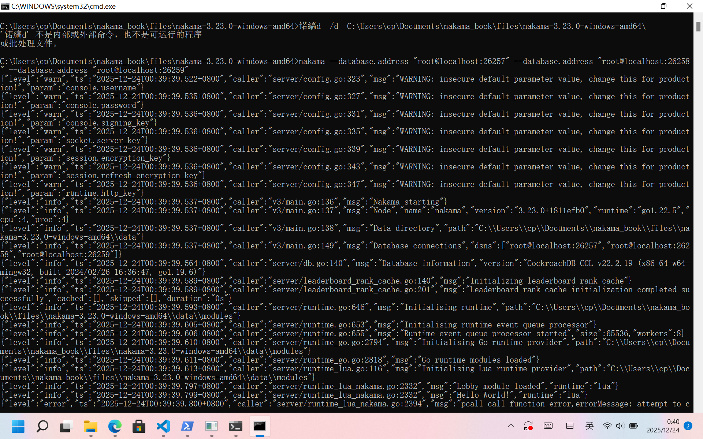

```log
{"level":"info","ts":"2025-12-24T00:39:39.537+0800","caller":"v3/main.go:149","msg":"Database connections","dsns":["root@localhost:26257","root@localhost:26258","root@localhost:26259"]}
{"level":"info","ts":"2025-12-24T00:39:39.564+0800","caller":"server/db.go:140","msg":"Database information","version":"CockroachDB CCL v22.2.19 (x86_64-w64-mingw32, built 2024/02/26 16:36:47, go1.19.6)"}
```

看到输出log里有3个节点了。

在后台也可以看到DB节点信息。

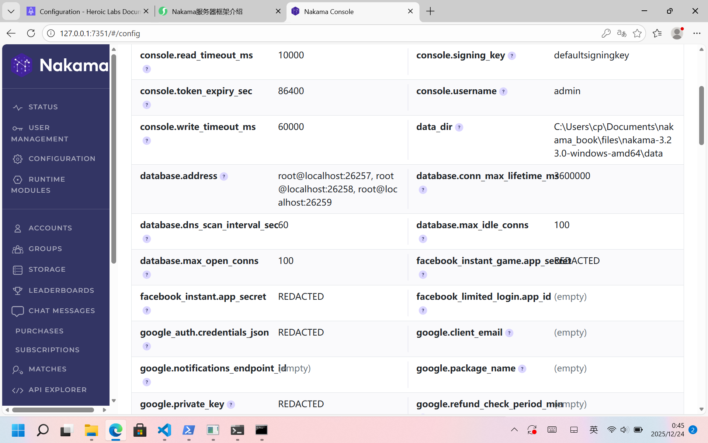

### 4. 使用Nakama后台

浏览器打开 `http://127.0.0.1:7351/` 访问Nakama后台。

用户名是 `admin`，密码是`password`。


登录后就进入后台了，默认打开的是状态页，其他功能自己探索吧。

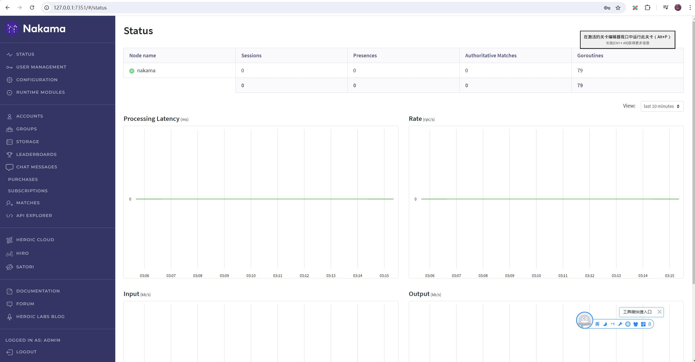


### 5. 停止Nakama服务器

直接在PowerShell控制台`ctrl+c`就行。

### 6. 自动创建了data目录

运行Nakama后，在文件夹里自动创建了下面的空目录结构。

```text
./data
./data/module
```

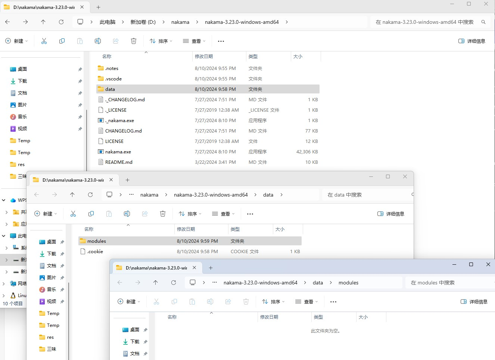

Nakama支持使用Go、Js、Lua来编写服务器逻辑，编写的Lua脚本放在`module`目录就会被加载运行，具体下一章介绍。
