## 在Windows安装Nakama服务器

参考官方文档：`https://heroiclabs.com/docs/nakama/getting-started/install/windows/`

### 1. 安装PostgreSQL

下载地址：`https://www.enterprisedb.com/downloads/postgres-postgresql-downloads`

选择自己想要的版本，点击下载图标即可。

然后会跳转到下载页面，就会自动下载。

如果没有自动下载，就点击 `Click here` 手动下载。

下载好之后就开始安装，按照下面步骤。

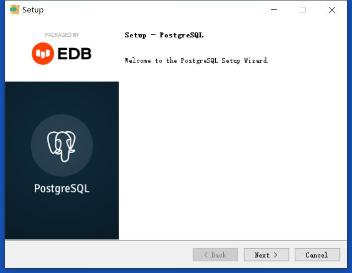

选择程序安装目录，这里就使用默认路径了。

选择组件，按图中勾选。

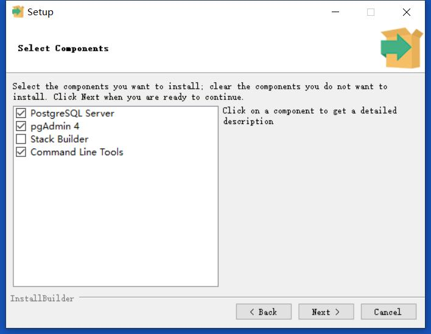

选择数据库保存目录，这里就使用默认路径了。

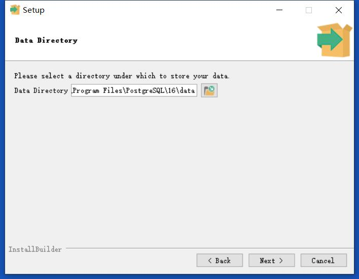

设置默认用户的密码，默认用户是`postgres`，这里密码就设置为`password`。

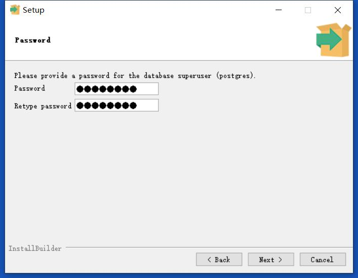

设置端口，用默认的。

设置地区，也默认就行。

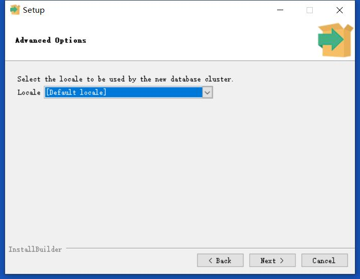

然后就一直下一步，等待安装完成。

### 2. 安装Nakama

下载地址：`https://github.com/heroiclabs/nakama/releases`

选择最新版本下载就行，我此时是 3.23.0。

在文件夹按住shift+鼠标右键，选择`在此处打开PowerShell窗口`。

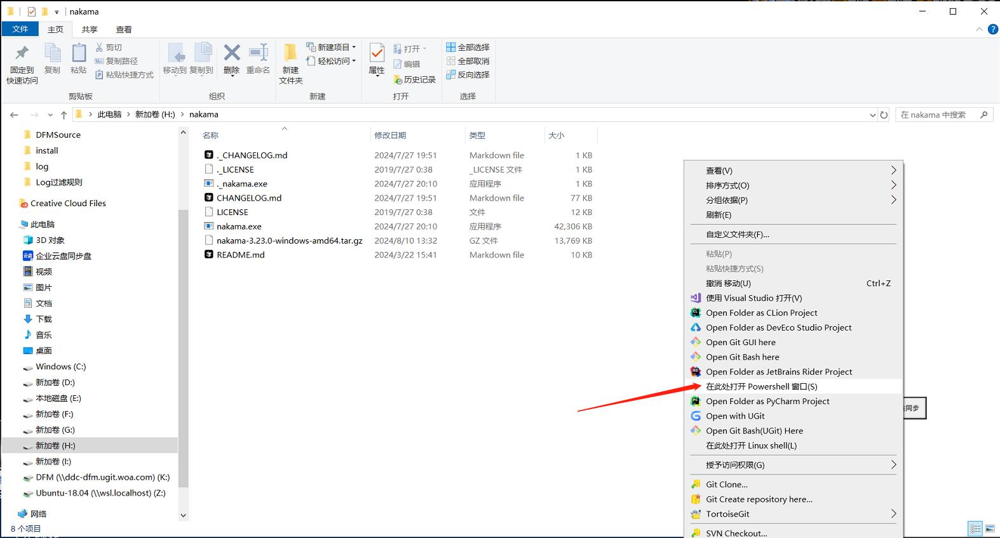

输入命令`tar -zxvf .\nakama-3.23.0-windows-amd64.tar.gz` 解压。

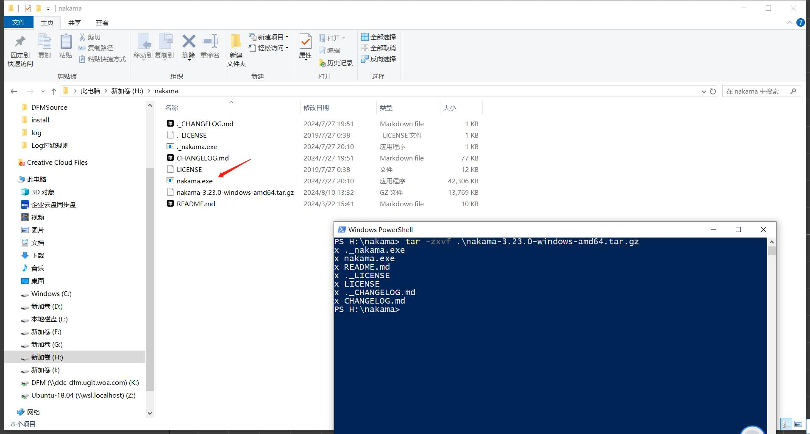

### 3. 同步数据库

现在刚安装好，需要往PostgreSql里创建一些数据库和表格才行。

Nakama提供了一个命令来自动创建数据库和表格。

在上面解压的PowerShell里继续执行命令:

`./nakama.exe migrate up --database.address postgres:password@127.0.0.1:5432`

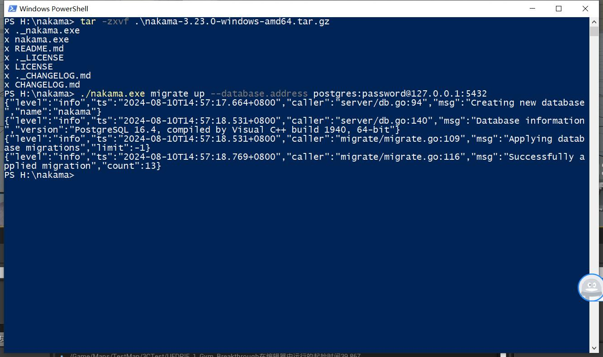

当看到最后输出`Successfully applied migration`时，说明数据库同步成功了。

### 4. 启动服务器

继续执行命令启动服务器：

`./nakama.exe --database.address postgres:password@127.0.0.1:5432`

看到`Startup done` 说明启动成功了。

中间如果出现了Windows防火墙，记得允许通过。

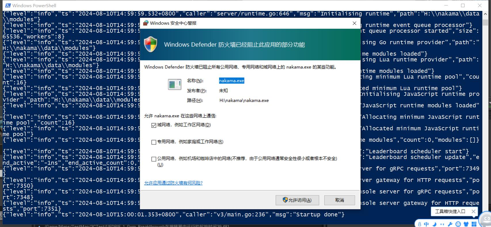

### 5. 使用Nakama后台

浏览器打开 `http://127.0.0.1:7351/` 访问Nakama后台。

用户名是 `admin`，密码是`password`。

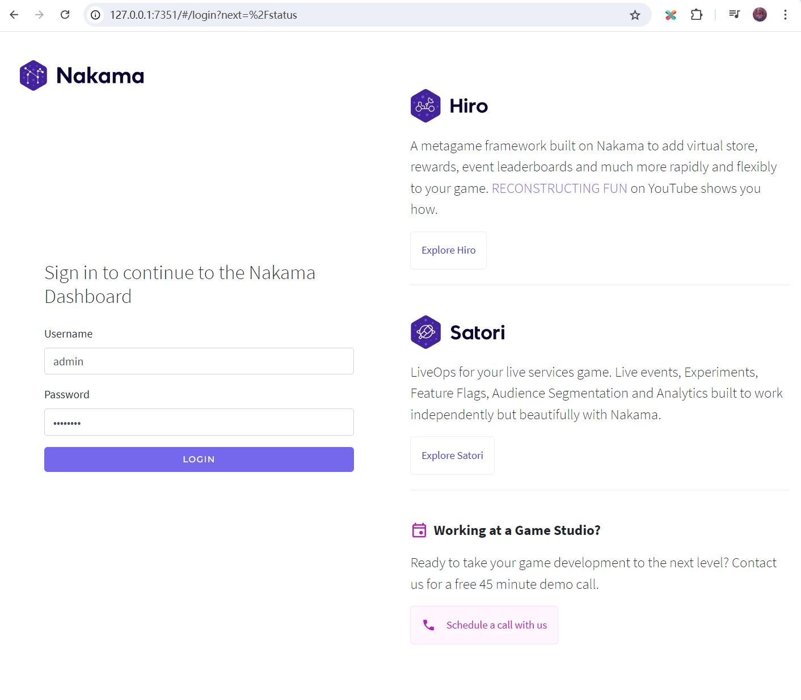

登录后就进入后台了，默认打开的是状态页，其他功能自己探索吧。

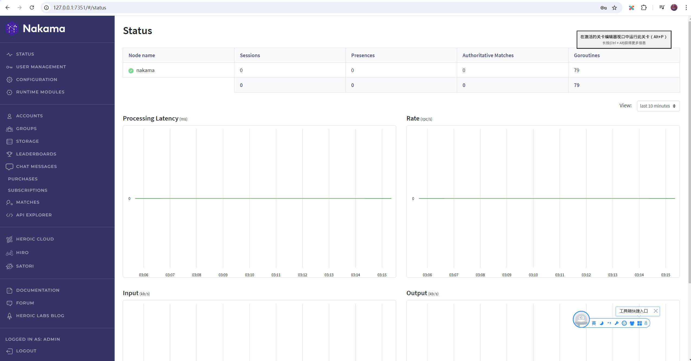

