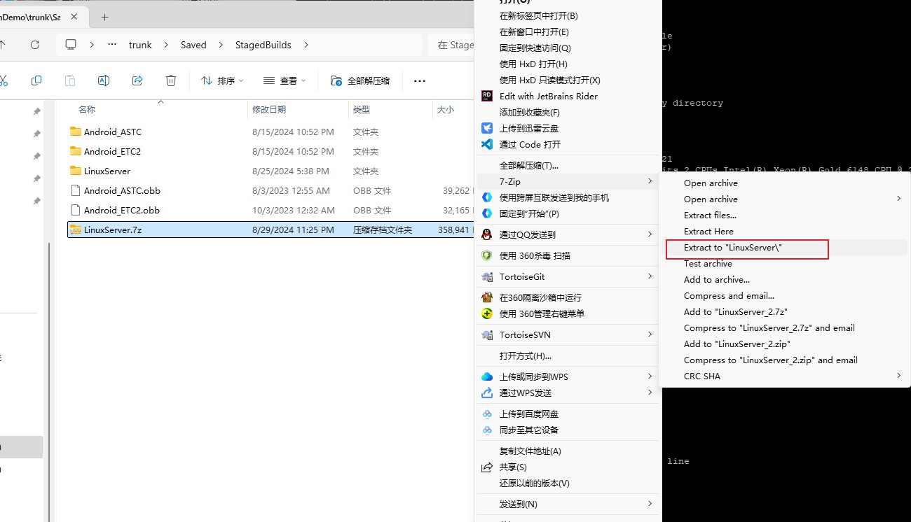
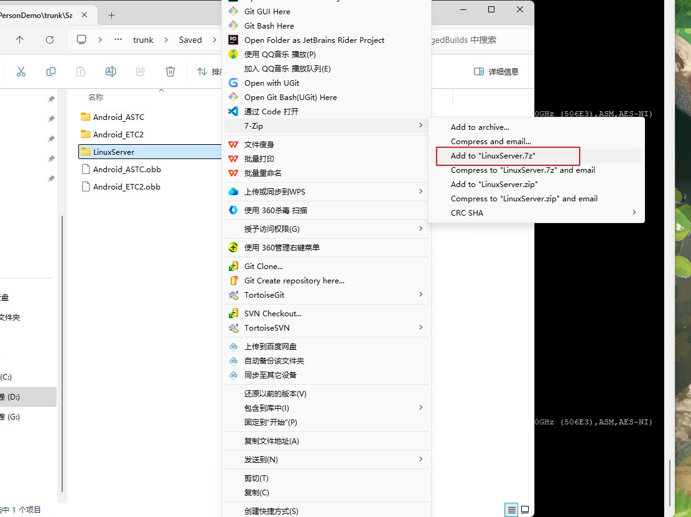

## Linux安装使用7z

在自己电脑上打包好LinuxServer后，压缩7z上传到云服务器比较快，所以要在云服务器上安装7z来解压。

### 1. 安装

```sh
sudo apt install p7zip-full
```

查看使用说明

```sh
ubuntu@VM-8-8-ubuntu:~/testperf$ 7z --help

7-Zip [64] 16.02 : Copyright (c) 1999-2016 Igor Pavlov : 2016-05-21
p7zip Version 16.02 (locale=en_US.utf8,Utf16=on,HugeFiles=on,64 bits,2 CPUs Intel(R) Xeon(R) Gold 6148 CPU @ 2.40GHz (506E3),ASM,AES-NI)

Usage: 7z <command> [<switches>...] <archive_name> [<file_names>...]
       [<@listfiles...>]

<Commands>
  a : Add files to archive
  b : Benchmark
  d : Delete files from archive
  e : Extract files from archive (without using directory names)
  h : Calculate hash values for files
  i : Show information about supported formats
  l : List contents of archive
  rn : Rename files in archive
  t : Test integrity of archive
  u : Update files to archive
  x : eXtract files with full paths
```

### 2. 解压

解压到文件名命名的文件夹中。

```sh
ubuntu@VM-8-8-ubuntu:~/testperf/ds$ 7z x LinuxServer.7z

7-Zip [64] 16.02 : Copyright (c) 1999-2016 Igor Pavlov : 2016-05-21
p7zip Version 16.02 (locale=en_US.utf8,Utf16=on,HugeFiles=on,64 bits,2 CPUs Intel(R) Xeon(R) Gold 6148 CPU @ 2.40GHz (506E3),ASM,AES-NI)

Scanning the drive for archives:
1 file, 367554613 bytes (351 MiB)

Extracting archive: LinuxServer.7z
--
Path = LinuxServer.7z
Type = 7z
Physical Size = 367554613
Headers Size = 25107
Method = LZMA2:26
Solid = +
Blocks = 1

Everything is Ok

Folders: 326
Files: 1877
Size:       2727984079
Compressed: 367554613
ubuntu@VM-8-8-ubuntu:~/testperf/ds$
```

相当于Windows上的



### 3. 压缩

```sh
ubuntu@VM-8-8-ubuntu:~/testperf/ds$ 7z a LinuxServer1.7z ./LinuxServer

7-Zip [64] 16.02 : Copyright (c) 1999-2016 Igor Pavlov : 2016-05-21
p7zip Version 16.02 (locale=en_US.utf8,Utf16=on,HugeFiles=on,64 bits,2 CPUs Intel(R) Xeon(R) Gold 6148 CPU @ 2.40GHz (506E3),ASM,AES-NI)

Scanning the drive:
326 folders, 1877 files, 2727984079 bytes (2602 MiB)

Creating archive: LinuxServer1.7z

Items to compress: 2203


Files read from disk: 1875
Archive size: 385680984 bytes (368 MiB)
Everything is Ok
ubuntu@VM-8-8-ubuntu:~/testperf/ds$
```

相当于Windows上的




