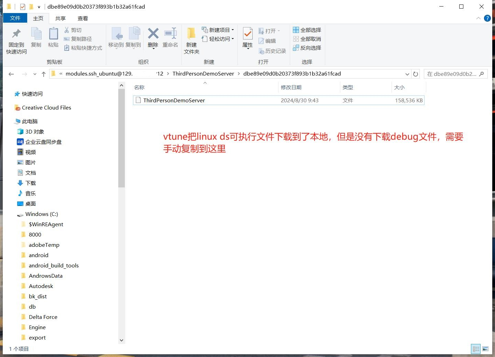

## Intel VTune分析DS性能

Intel VTune是一个性能分析工具，和perf类似，但是VTune跨平台支持多系统，而且是自带友好界面，在Windows上就能分析Linux DS性能，不用去Linux上敲命令。

### 1. 安装VTune

下载地址：`https://www.intel.com/content/www/us/en/developer/tools/oneapi/vtune-profiler-download.html`

选择自己的系统安装包。

### 2. 使用VTune分析Linux DS

VTune的原理是先SSH连接到Linux服务器，在Linux服务器上对DS进行性能分析，然后把DS可执行文件和性能分析数据下载到本地，进行分析。

### 2.1 新建分析配置

### 2.2 填写服务器信息

填写好之后，VTune会打开SSH窗口提示登录，并生成Token用于自动登录，如果有弹窗，记得点同意。

### 2.3 选择要分析的进程

### 2.4 开始分析

### 2.5 停止分析

### 2.6 复制调试文件

下载完性能数据到本地，开始解析，会提示找不到调试文件。

这是因为，VTune的原理是先SSH连接到Linux服务器，在Linux服务器上对DS进行性能分析，然后把DS可执行文件和性能分析数据下载到本地，进行分析。

然后VTune并不会把可执行文件对应的调试文件下载到本地。

从提示中复制路径打开，可以看到确实只有可执行文件。

复制调试文件过去。

再次重试。

没有提示了，说明加载到调试文件了。

### 2.7 查看结果

解析完毕后，会先给出一个总结。

点击右边标签页就可以查看函数堆栈了。

