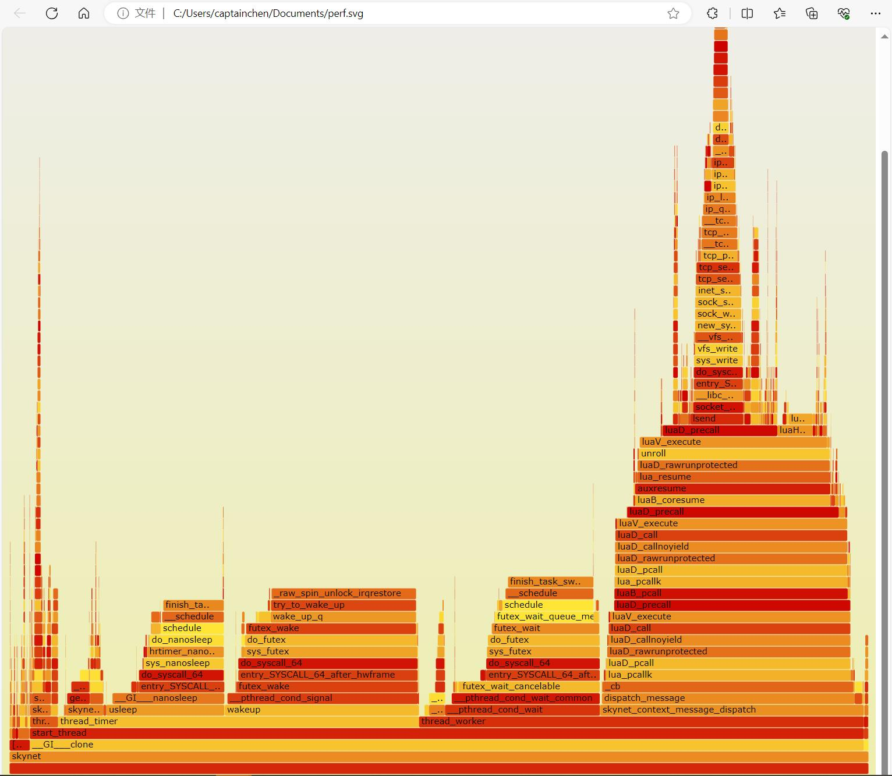
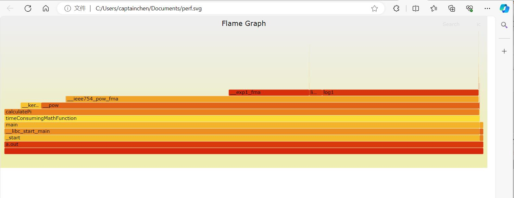

## Perf性能&火焰图

### 1. 准备好FlameGraph

Clone火焰图仓库

`git clone https://github.com/brendangregg/FlameGraph.git`

### 2. 录制现有进程

先根据进程名查找到进程ID

```sh
ubuntu@VM-8-8-ubuntu:~/testperf$ ps aux | grep skynet
ubuntu   14981  0.0  0.0  13776  1088 pts/12   S+   18:19   0:00 grep --color=auto skynet
ubuntu   31566  1.2  1.2 208212 25292 pts/7    Sl+  Apr08 2668:41 ./skynet ./server/loginserver/loginserver.config
ubuntu   31995  1.7  3.5 607076 73388 pts/9    Sl+  Apr08 3568:22 ./skynet ./server/gameserver/gameserver.config
```

第二列就是PID。

录制一段时间，`-p` 后面跟着进程ID。

```sh
sudo perf record -e cpu-clock --call-graph dwarf -p 31995
```

按`ctrl+c`结束后，会生成 `perf.data`文件。

然后解析，生成`perf.unfold`文件

```sh
sudo perf script -i perf.data &> perf.unfold
```

然后使用FlameGraph生成火焰图svg。

```sh
./FlameGraph/stackcollapse-perf.pl perf.unfold &> perf.folded
./FlameGraph/flamegraph.pl perf.folded > perf.svg
```

然后把生成的`perf.svg`下载到电脑上，用EDGE或者Chrome之类的浏览器打开。




### 3. 启动新进程录制

编写一个新的程序`test.cpp`，内容如下：

```c++
#include <iostream>
#include <chrono>
#include <cmath>

// 计算π的BBP公式的一个简化版本
double calculatePi(int iterations) {
    double pi = 0.0;
    for (int i = 0; i < iterations; ++i) {
        double numerator = pow(16, i) - 4 * pow(4, i) + 1;
        double denominator = pow(4, 2 * i + 1);
        pi += numerator / denominator;
    }
    return pi;
}

// 耗时的数学计算函数
void timeConsumingMathFunction(int durationInSeconds, int precision) {
    std::cout << "Function started. Calculating PI with " << precision << " iterations." << std::endl;
    
    // 使用C++11中的chrono库来测量时间
    auto start = std::chrono::steady_clock::now();
    auto end = start + std::chrono::seconds(durationInSeconds);
    
    while (std::chrono::steady_clock::now() < end) {
        calculatePi(precision);
    }
    
    std::cout << "Function finished." << std::endl;
}

int main() {
    // 调用函数，设置为运行5秒，每次计算使用1000次迭代
    timeConsumingMathFunction(5, 1000);
    return 0;
}
```

输入命令编译：

```sh
g++ test.cpp
```

编译生成`a.out`。

启动新的程序来录制，录制`a.out`这个刚编译好的程序。

```sh
ubuntu@VM-8-8-ubuntu:~/testperf$ ls
a.out  FlameGraph  perf.data  perf.data.old  perf.folded  perf.svg  perf.unfold  test.cpp
ubuntu@VM-8-8-ubuntu:~/testperf$ sudo perf record -e cpu-clock --call-graph dwarf ./a.out
Function started. Calculating PI with 1000 iterations.
Function finished.
[ perf record: Woken up 642 times to write data ]
[ perf record: Captured and wrote 160.652 MB perf.data (19956 samples) ]
ubuntu@VM-8-8-ubuntu:~/testperf$
```

剩下的步骤和上面一样，svg如下：



### 4. 一些问题

FlameGraph脚本执行出错

Stack count is low (1). Did something go wrong?

是前置步骤，执行下面命令没加`sudo`导致的。

```sh
sudo perf script -i perf.data &> perf.unfold
```

