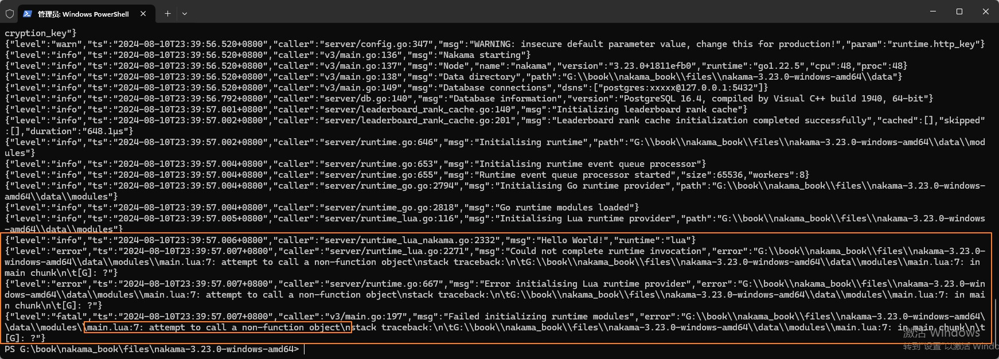
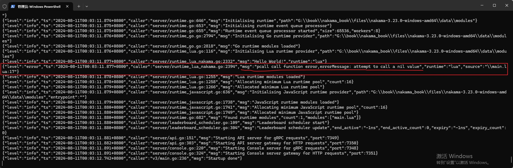

## 兼容性与错误处理

Nakama使用的是Lua 5.1，并且使用的是沙箱机制，所以只能用纯Lua脚本，并且只支持一部分Lua API。

具体请参考 `https://heroiclabs.com/docs/nakama/server-framework/lua-runtime/`。

### 1. 单线程

Nakama Lua Runtime不支持协程。

### 2. 沙盒

Lua 运行时代码是完全沙箱化的，无法访问文件系统、输入/输出设备，也无法生成操作系统线程或进程。

这使得服务器可以保证 Lua 模块不会导致致命错误 - 运行时代码不会触发意外的客户端断开连接或影响主服务器进程。

### 3. 无状态

由于Nakama是一个分布式的服务器，所以不要在Lua中使用全局变量。

务必将LuaRuntime作为云函数来使用，就是说它是无状态的。

### 4. 异常处理

在Lua逻辑代码中出现错误将让Nakama退出，例如下面的代码调用了一个不存在的函数，Lua异常打断了Nakama的启动过程。

```lua
---fille:main.lua

--导入nakama库
local nk = require("nakama")

--输出log
nk.logger_info("Hello World!")

--调用一个不存在的函数
call_null_func()
```




使用pcall(protected call)保护模式调用这个不存在的函数，在出错时可以做一些异常处理，不会打断Nakama运行。

```lua
---fille:main.lua

--导入nakama库
local nk = require("nakama")

--输出log
nk.logger_info("Hello World!")

--调用一个不存在的函数
-- call_null_func()

--以pcall(protected call)保护模式调用一个不存在的函数
local result,errorMessage = pcall(call_null_func)
if result then
    --如果返回true，表示pcall运行的函数没有错误
    nk.logger_info("pcall call function no error")
else
    --如果返回false，表示pcall运行的函数有错误，这里可以做一些异常处理。
    nk.logger_error("pcall call function error,errorMessage: " .. errorMessage)
end
```



官方文档给了一个Nakama实际应用的例子，如下代码：

```lua
---用处：通过用户名查找玩家
local nk = require("nakama")

--保护模式执行 nk.users_get_username({"22e9ed62"})
local status, result = pcall(nk.users_get_username, {"22e9ed62"})
if (not status) then
    --函数执行出错，输出错误信息
    nk.logger_error(string.format("Error occurred: %q", result))
else
    --函数执行成功，遍历输出找到的玩家信息
    for _, u in ipairs(result)
    do
        local message = string.format("id: %q, display name: %q", u.id, u.display_name)
        nk.logger_info(message) -- Will appear in logging output.
    end
end
```

### 5. 返回错误码给客户端

在编写Nakama逻辑时，应该对客户端所有的请求，都要返回详细丰富的错误信息以及正确的HTTP状态码。

在Nakama LuaRuntime中，直接使用`error({})`即可向客户端返回错误信息以及HTTP状态码，例如下面的例子：

```lua
--向客户端返回错误信息以及HTTP状态码
error({ "input contained invalid data", error_codes.INVALID_ARGUMENT})
```

`error_codes` 是错误码。

Nakama使用gRPC错误码，并在将错误返回给客户端时将其转换为适当的HTTP状态代码。

可以在 Lua 模块中将 gRPC 错误代码定义为常量，如下所示：

```lua
local error_codes = {
  OK                  = 0,  -- HTTP 200
  CANCELED            = 1,  -- HTTP 499
  UNKNOWN             = 2,  -- HTTP 500
  INVALID_ARGUMENT    = 3,  -- HTTP 400
  DEADLINE_EXCEEDED   = 4,  -- HTTP 504
  NOT_FOUND           = 5,  -- HTTP 404
  ALREADY_EXISTS      = 6,  -- HTTP 409
  PERMISSION_DENIED   = 7,  -- HTTP 403
  RESOURCE_EXHAUSTED  = 8,  -- HTTP 429
  FAILED_PRECONDITION = 9,  -- HTTP 400
  ABORTED             = 10, -- HTTP 409
  OUT_OF_RANGE        = 11, -- HTTP 400
  UNIMPLEMENTED       = 12, -- HTTP 501
  INTERNAL            = 13, -- HTTP 500
  UNAVAILABLE         = 14, -- HTTP 503
  DATA_LOSS           = 15, -- HTTP 500
  UNAUTHENTICATED     = 16  -- HTTP 401
}
```

下面是一个示例，说明如何在 `RPC` 调用和 `Before Hook` 中返回适当的错误。

```lua

--RPC调用:创建公会
nk.register_rpc(function(context, payload)
    --模拟公会名被占用的错误
    local already_exists = true

    if already_exists then
        --公会名被占用，向客户端返回详细错误信息，以及错误码
        error({ "guild name is in use", error_codes.ALREADY_EXISTS })
    end

    --注意：因为Nakama LuaRuntime是过程式无状态的，所以传入的数据一定要传出去，让后续的其他逻辑使用。
    return nk.json_encode({ success = true })
end, "lua_create_guild")

--在Nakama执行AuthenticateCustom接口前添加钩子Hook住，对账号名进行判断是否合法。
nk.register_req_before(function(context, payload)
	-- Only match custom Id in the format "cid-000000"
    if not string.match(payload.account.id, "^cid%-%d%d%d%d%d%d$") then
        --账号ID不合法，向客户端返回详细错误信息，以及错误码
        error({ "input contained invalid data", error_codes.INVALID_ARGUMENT})
    end

    --注意：因为Nakama LuaRuntime是过程式无状态的，所以传入的数据一定要传出去，让后续的其他逻辑使用。
    return payload
end, "AuthenticateCustom")
```


    关于nk.register_rpc：
    https://heroiclabs.com/docs/nakama/server-framework/lua-runtime/function-reference/#register_rpc

    关于nk.register_req_before：
    https://heroiclabs.com/docs/nakama/server-framework/lua-runtime/function-reference/#register_req_before