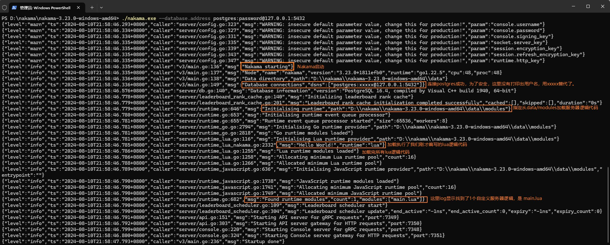

## Hello World

### 1. 第一个例子

在`./data/module`目录中新建`main.lua`，编写下面的代码。

```lua
---file:main.lua

--导入nakama库
local nk = require("nakama")

--输出log
nk.logger_info("Hello World!")
```

在`nakama.exe`所在文件夹按住`shift+右键`，选择 `在此处打开 Powershell 窗口` 打开 Powershell，然后执行命令启动。

`./nakama.exe --database.address postgres:password@127.0.0.1:5432`

在log中可以看到成功加载并执行了上面的lua逻辑代码。


