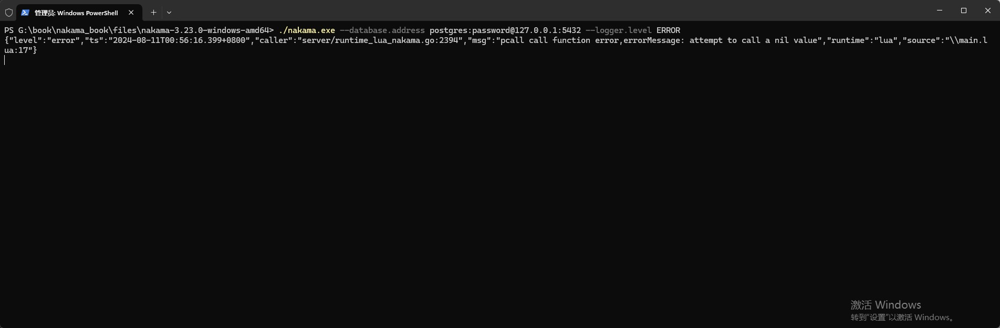

## Hello World

### 1. 第一个例子

在`./data/module`目录中新建`main.lua`，编写下面的代码。

```lua
---file:main.lua

--导入nakama库
local nk = require("nakama")

--输出log
nk.logger_info("Hello World!")
```

在`nakama.exe`所在文件夹按住`shift+右键`，选择 `在此处打开 Powershell 窗口` 打开 Powershell，然后执行命令启动。

`./nakama.exe --database.address postgres:password@127.0.0.1:5432`

在log中可以看到成功加载并执行了上面的lua逻辑代码。


### 2. 兼容性

Nakama使用的是Lua 5.1，并且使用的是沙箱机制，所以只能用纯Lua脚本，并且只支持一部分Lua API。

具体请参考 `https://heroiclabs.com/docs/nakama/server-framework/lua-runtime/`。

#### 2.1 单线程

Nakama Lua Runtime不支持协程。

#### 2.2 沙盒

Lua 运行时代码是完全沙箱化的，无法访问文件系统、输入/输出设备，也无法生成操作系统线程或进程。

这使得服务器可以保证 Lua 模块不会导致致命错误 - 运行时代码不会触发意外的客户端断开连接或影响主服务器进程。

#### 2.3 无状态

由于Nakama是一个分布式的服务器，所以不要在Lua中使用全局变量。

务必将LuaRuntime作为云函数来使用，就是说它是无状态的。

### 3. 异常处理

在Lua逻辑代码中出现错误将让Nakama退出，例如下面的代码调用了一个不存在的函数，Lua异常打断了Nakama的启动过程。

```lua
---fille:main.lua

--导入nakama库
local nk = require("nakama")

--输出log
nk.logger_info("Hello World!")

--调用一个不存在的函数
call_null_func()
```


使用pcall(protected call)保护模式调用这个不存在的函数，在出错时可以做一些异常处理，不会打断Nakama运行。

```lua
---fille:main.lua

--导入nakama库
local nk = require("nakama")

--输出log
nk.logger_info("Hello World!")

--调用一个不存在的函数
-- call_null_func()

--以pcall(protected call)保护模式调用一个不存在的函数
local result,errorMessage = pcall(call_null_func)
if result then
    --如果返回true，表示pcall运行的函数没有错误
    nk.logger_info("pcall call function no error")
else
    --如果返回false，表示pcall运行的函数有错误，这里可以做一些异常处理。
    nk.logger_error("pcall call function error,errorMessage: " .. errorMessage)
end
```


官方文档给了一个Nakama实际应用的例子，如下代码：

```lua
---用处：通过用户名查找玩家
local nk = require("nakama")

--保护模式执行 nk.users_get_username({"22e9ed62"})
local status, result = pcall(nk.users_get_username, {"22e9ed62"})
if (not status) then
    --函数执行出错，输出错误信息
    nk.logger_error(string.format("Error occurred: %q", result))
else
    --函数执行成功，遍历输出找到的玩家信息
    for _, u in ipairs(result)
    do
        local message = string.format("id: %q, display name: %q", u.id, u.display_name)
        nk.logger_info(message) -- Will appear in logging output.
    end
end
```

### 4. Log等级

Nakama的Log等级默认为Info，上面例子中使用`nk.logger_info`输出的Log都会在控制台中看到。

在启动Nakama时可以指定Log等级，例如下面设置为`Error`。

`./nakama.exe --database.address postgres:password@127.0.0.1:5432 --logger.level ERROR`

可以看到只有`nk.logger_error`输出的错误日志才在控制台中显示。

