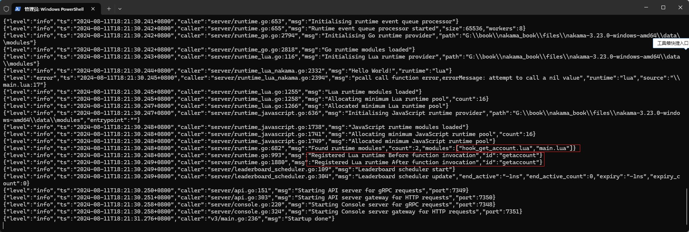
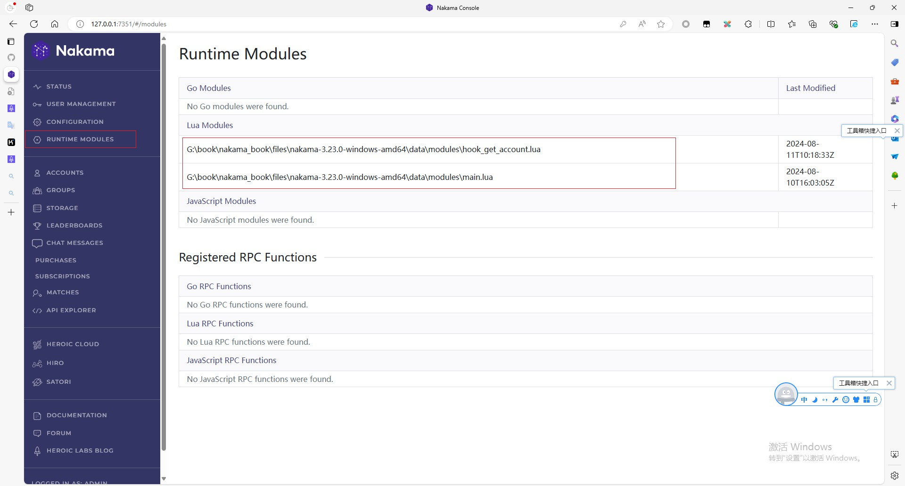
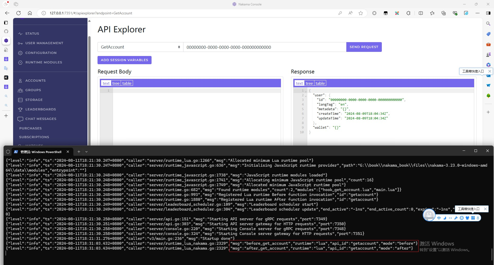

## Hook

Nakama服务器实现了局外游戏服务器的大部分功能，所以大部分时候，我们都是调用Nakama提供的内置API。

那如何实现一些自定义的功能呢，比如在聊天时，对聊天内容进行关键词检测？

这就用到Hook接口了，即Nakama提供了一个接口，在内置API执行之前和之后，可以插入自定义的逻辑。

在前面介绍`API Explorer`时，在`API Explorer`中调用执行了`GetAccount`这个API，来查询账号信息。

那么现在我们就通过Hook，在`GetAccount`这个API执行的前后插入自定义逻辑。

主要用到两个接口`nk.register_req_before` 和 `nk.register_req_after`。

### 1. 注册Hook自定义逻辑

新建Lua脚本 `./data/modules/hook_get_account.lua`，内容如下：

```lua
---file:./data/modules/hook_get_account.lua

--导入nakama库
local nk = require("nakama")

--在GetAccount执行之前执行的函数
local function before_get_account(context, payload)
    --执行自定义逻辑
    nk.logger_info("before_get_account")

    --一定要把payload返回，让GetAccount继续执行
    return payload
end

--在GetAccount执行之后执行的函数
local function after_get_account(context, payload)
    --执行自定义逻辑
    nk.logger_info("after_get_account")

    --一定要把payload返回，让GetAccount继续执行
    return payload
end

--注册GetAccount的钩子函数
nk.register_req_before(before_get_account, "GetAccount")
nk.register_req_after(after_get_account, "GetAccount")
```

重新启动Nakama后，在Log中可以看到成功加载了`hook_get_account.lua`，也成功注册了Hook。



除了在Log中查看，也可以在Nakama Console中查看加载的模块。



不过看不到注册的Hook。

### 2. 使用API Explorer测试Hook

在`API Explorer`中，选择`GetAccount`这个API，并填入UserID，点击请求。

可以看到输出了Hook函数中的Log，先`before`，然后`after`，说明Hook成功注册了。

