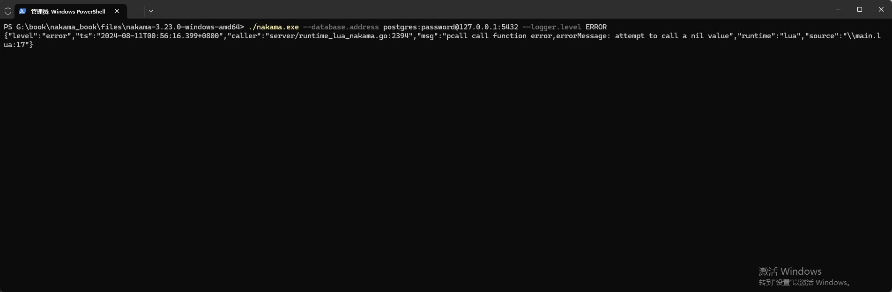

## Logger等级设置

Nakama的Log等级默认为Info，前面例子(下面代码)中使用`nk.logger_info`输出的Log，以及Nakama启动时的Log，都会在控制台中看到。

```lua
---fille:main.lua

--导入nakama库
local nk = require("nakama")

--输出log
nk.logger_info("Hello World!")

--调用一个不存在的函数
-- call_null_func()

--以pcall(protected call)保护模式调用一个不存在的函数
local result,errorMessage = pcall(call_null_func)
if result then
    --如果返回true，表示pcall运行的函数没有错误
    nk.logger_info("pcall call function no error")
else
    --如果返回false，表示pcall运行的函数有错误，这里可以做一些异常处理。
    nk.logger_error("pcall call function error,errorMessage: " .. errorMessage)
end
```

在启动Nakama时可以指定Log等级，例如下面设置为`Error`。

`./nakama.exe --database.address postgres:password@127.0.0.1:5432 --logger.level ERROR`

可以看到只有`nk.logger_error`输出的错误日志才在控制台中显示。

