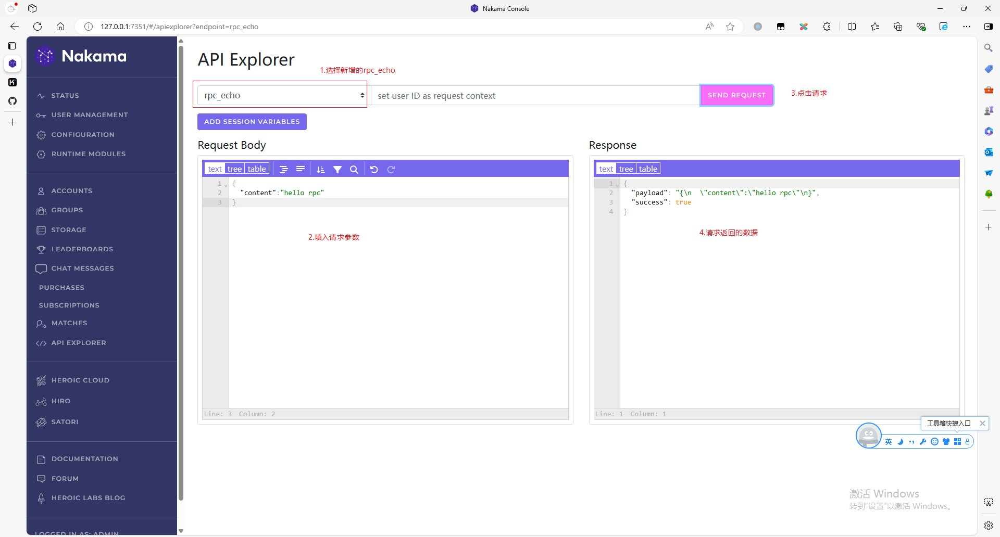
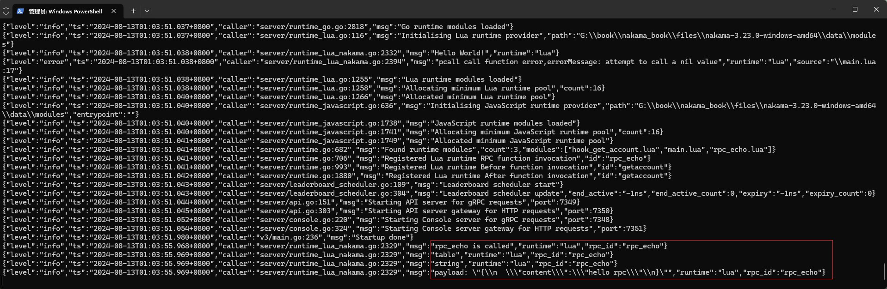

## 自定义RPC

除了Nakama内置的API，通过`nk.register_rpc`，我们也可以自定义RPC请求。

    关于nk.register_rpc：
    https://heroiclabs.com/docs/nakama/server-framework/lua-runtime/function-reference/#register_rpc

### 1. Echo实例

新建Lua模块脚本 `./data/modules/rpc_echo.lua`，内容如下：

```lua
---file:./data/modules/rpc_echo.lua

--导入nakama库
local nk = require("nakama")

--- 将请求的数据返回给客户端
---@param context table 请求的上下文
---@param payload string 请求的数据，是json，可以用nk.json_decode(payload)解析
---@return string 返回json格式的数据
function rpc_echo(context, payload)
    nk.logger_info("rpc_echo is called")

    --打印context类型(table)
    nk.logger_info(type(context))

    --打印payload类型(string)
    nk.logger_info(type(payload))

    --打印payload
    nk.logger_info(("payload: %q"):format(payload))

    --返回结果&请求的数据
    return nk.json_encode({ success = true , payload = payload })
end


nk.register_rpc(rpc_echo, "rpc_echo")
```

重启Nakama，登录Console，在`RUNTIME MODULES`里查看是否成功加载了`rpc_echo.lua`。


### 2. API Explorer测试

在`API Explorer`选择上面新增的`rpc_echo`，然后填入请求参数，点击请求按钮，就可以收到返回的数据。



查看输出的Log，可以看到打印出的参数类型。



