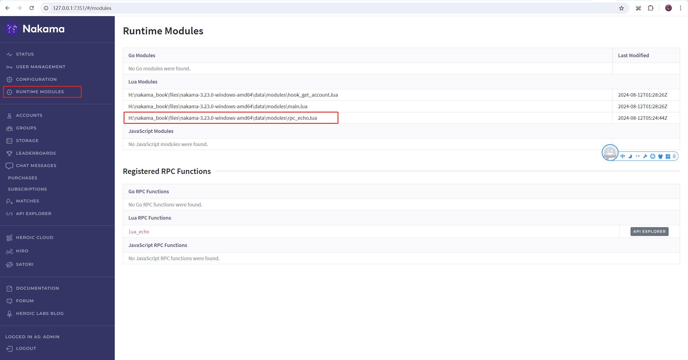

## 自定义RPC

除了Nakama内置的API，通过`nk.register_rpc`，我们也可以自定义RPC请求。

    关于nk.register_rpc：
    https://heroiclabs.com/docs/nakama/server-framework/lua-runtime/function-reference/#register_rpc

### 1. Echo实例

新建Lua模块脚本 `./data/modules/rpc_echo.lua`，内容如下：

```lua
---file:./data/modules/rpc_echo.lua

--导入nakama库
local nk = require("nakama")

--注册RPC调用
nk.register_rpc(function(context, payload)
    --返回结果
    return nk.json_encode({ success = true })
end, "lua_echo")
```

重启Nakama，登录Console，在`RUNTIME MODULES`里查看是否成功加载了`rpc_echo.lua`。



### 2. API Explorer测试

