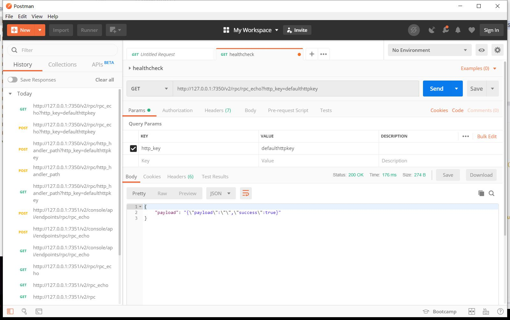
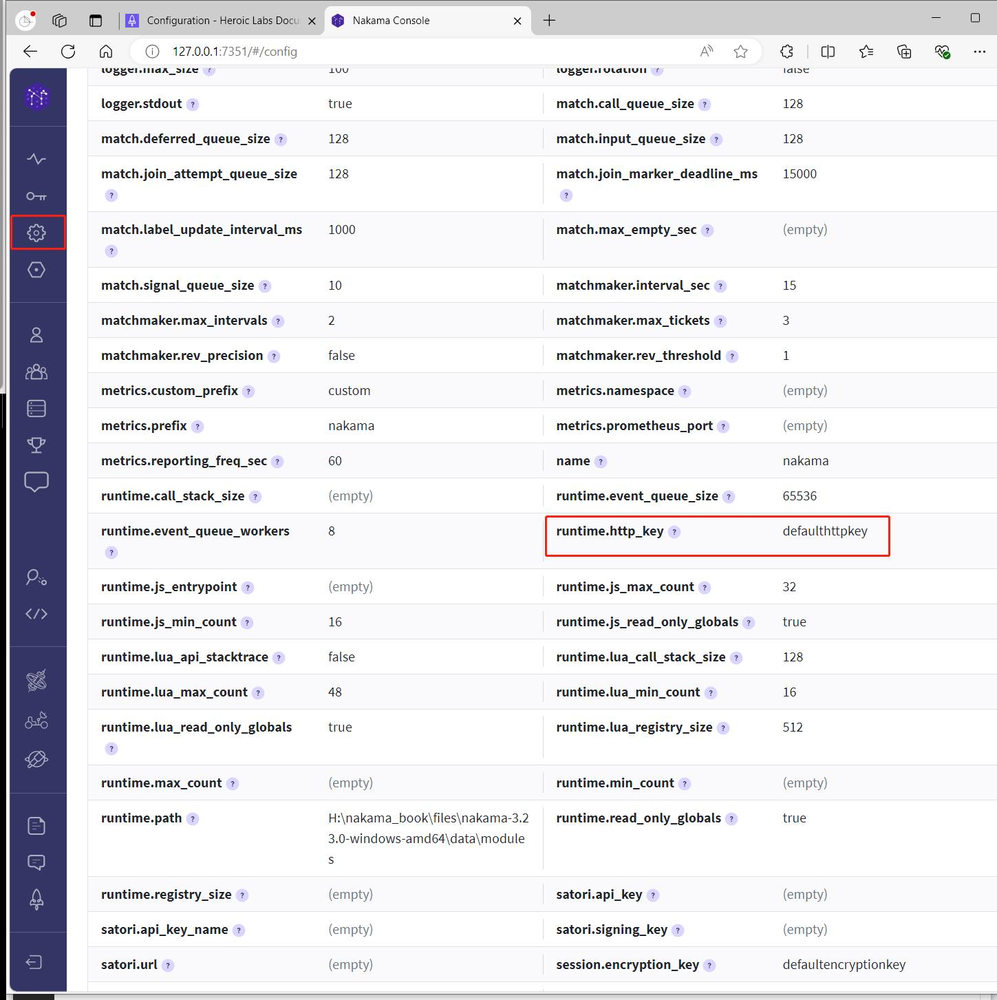

## 三方服务器与Nakama交互

    文档：https://heroiclabs.com/docs/nakama/server-framework/runtime-examples/#server-to-server

在我们的服务器框架设计里，DS需要向Nakama发送Http请求，来让Nakama执行一些操作或返回某些数据。

### 1. http请求rpc返回

Nakama支持HTTP请求，来执行自定义的RPC函数，例如之前添加的`rpc_echo`。

它提供了一个`http_key`，对来自三方的服务器的请求，进行安全性验证。

访问的Url格式：`http://127.0.0.1:7350/v2/rpc/rpc_echo?http_key=defaulthttpkey`

下面使用postman来执行一次请求。

在正式环境中需要修改`http_key`。

### 2. 修改http_key

正式环境中需要修改好几个Key，参考文档：`https://heroiclabs.com/docs/nakama/getting-started/configuration/#common-properties`

在网页后台`http://127.0.0.1:7351/#/config` 可以修改。

### 3. Nakama请求三方服务器

例如在渠道SDK登录验证时，客户端首先通过SDK登录获取到Token，然后传递给Nakama，Nakama需要向渠道SDK服务器，发出Http请求校验Token合法性及有效期。

