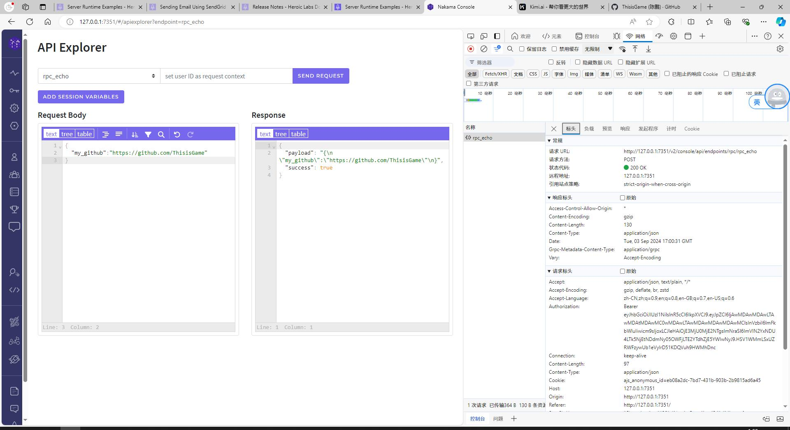
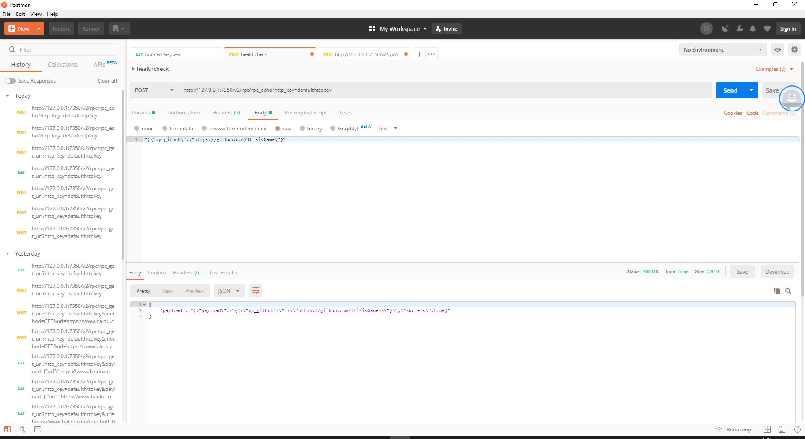
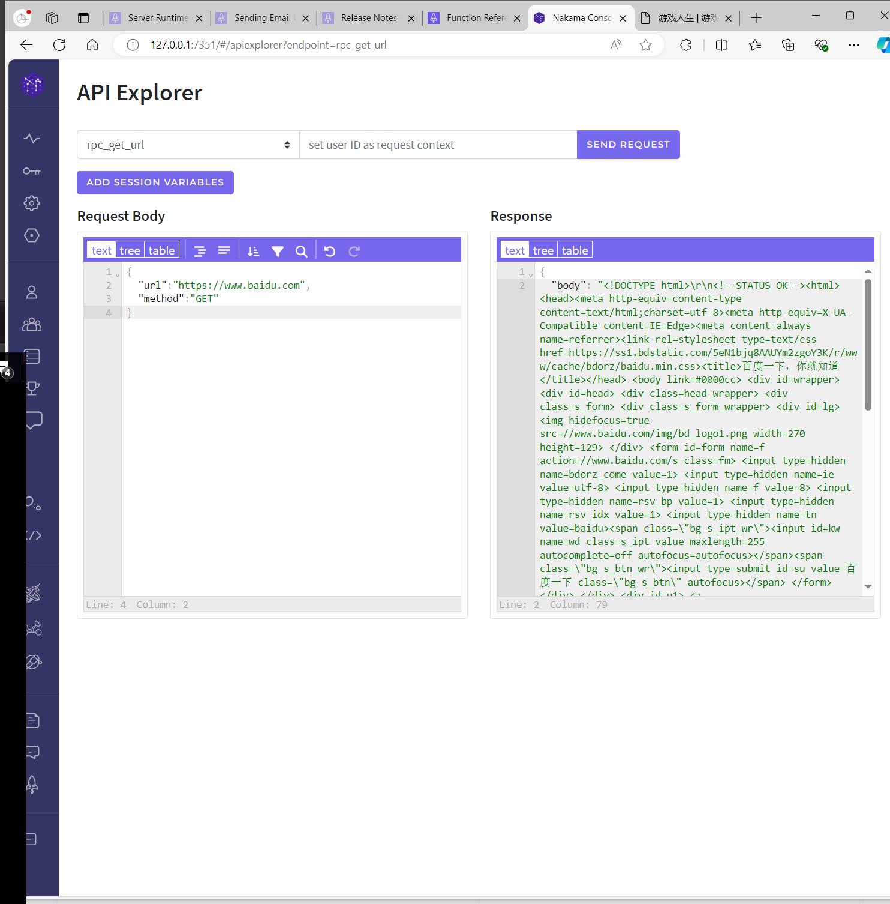
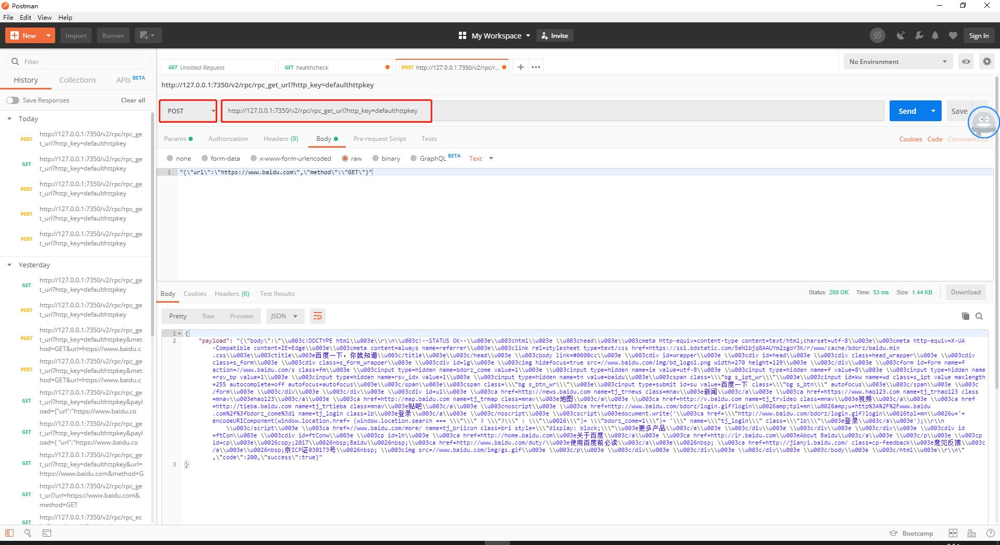

## 三方服务器与Nakama交互

    文档：https://heroiclabs.com/docs/nakama/server-framework/runtime-examples/#server-to-server

在我们的服务器框架设计里，DS需要向Nakama发送Http请求，来让Nakama执行一些操作或返回某些数据。

### 1. http请求rpc返回

Nakama支持HTTP请求，来执行自定义的RPC函数，例如之前添加的`rpc_echo`。

在控制台访问时，其实就是在网页上向Nakama服务器发送了一个Post请求。



如果是在三方服务器，它提供了一个`http_key`，对来自三方的服务器的请求，进行安全性验证。

访问的Url格式：`http://127.0.0.1:7350/v2/rpc/rpc_echo?http_key=defaulthttpkey`

下面使用postman来执行一次请求。




<font color=red>在正式环境中需要修改`http_key`。</font>

### 2. 修改http_key

正式环境中需要修改好几个Key，参考文档：`https://heroiclabs.com/docs/nakama/getting-started/configuration/#common-properties`

在网页后台`http://127.0.0.1:7351/#/config` 可以修改。


### 3. Nakama请求三方服务器

例如在渠道SDK登录验证时，客户端首先通过SDK登录获取到Token，然后传递给Nakama，Nakama需要向渠道SDK服务器，发出Http请求校验Token合法性及有效期。

下面以访问url作为实例，三方服务器调用了rpc访问了指定的url，并将访问url结果返回给调用方。

```lua
---file:files\nakama-3.23.0-windows-amd64\data\modules\rpc_get_url.lua

--导入nakama库
local nk = require("nakama")

--- 请求Url并将结果返回给客户端
---@param context table 请求的上下文
---@param payload string 请求的数据，是json，可以用nk.json_decode(payload)解析
---@return string 返回json格式的数据
function rpc_get_url(context, payload)
    nk.logger_info("rpc_get_url is called")

    --打印context类型(table)
    nk.logger_info(type(context))

    --打印payload类型(string)
    nk.logger_info(type(payload))

    --打印payload
    nk.logger_info(("payload: %q"):format(payload))

    --从payload解析url
    local payload_table = nk.json_decode(payload)
    local url = payload_table.url
    local method = payload_table.method
    nk.logger_info(("url: %q method: %q"):format(url, method))

    --访问url
    local headers = {
        ["Content-Type"] = "application/json",
        ["Accept"] = "application/json"
    }
    local content = nk.json_encode({}) -- encode table as JSON string
    local timeout = 5000 -- 5 seconds timeout
    local success, code, headers, body = pcall(nk.http_request, url, method, headers, content, timeout)

    --返回结果
    if (not success) then
        nk.logger_error(string.format("Failed %q", code))
        return nk.json_encode({ success = false , code = code })
    elseif (code >= 400) then
        nk.logger_error(string.format("Failed %q %q", code, body))
        return nk.json_encode({ success = false , code = code, body = body })
    else
        nk.logger_info(string.format("Success %q %q", code, body))
        return nk.json_encode({ success = true , code = code, body = body })
    end
end


nk.register_rpc(rpc_get_url, "rpc_get_url")
```

从控制台选择接口，并指定参数。



也可以在Postman中访问，则需要指定`http_key`。


