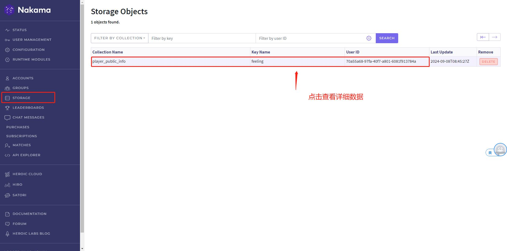
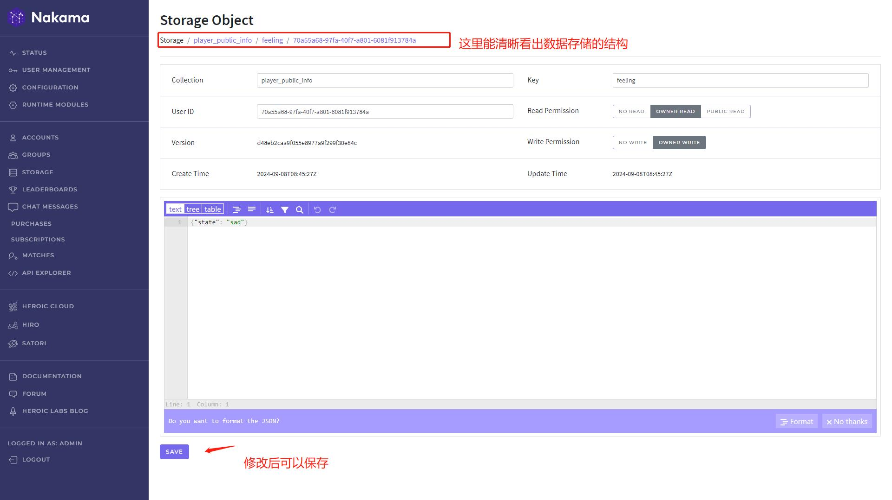
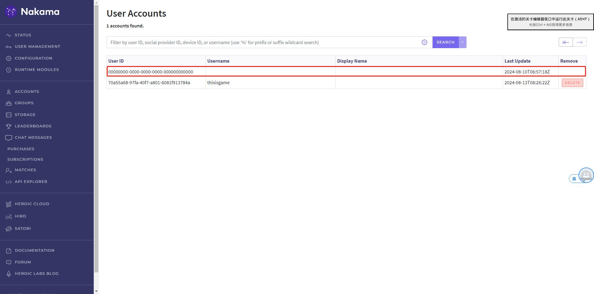
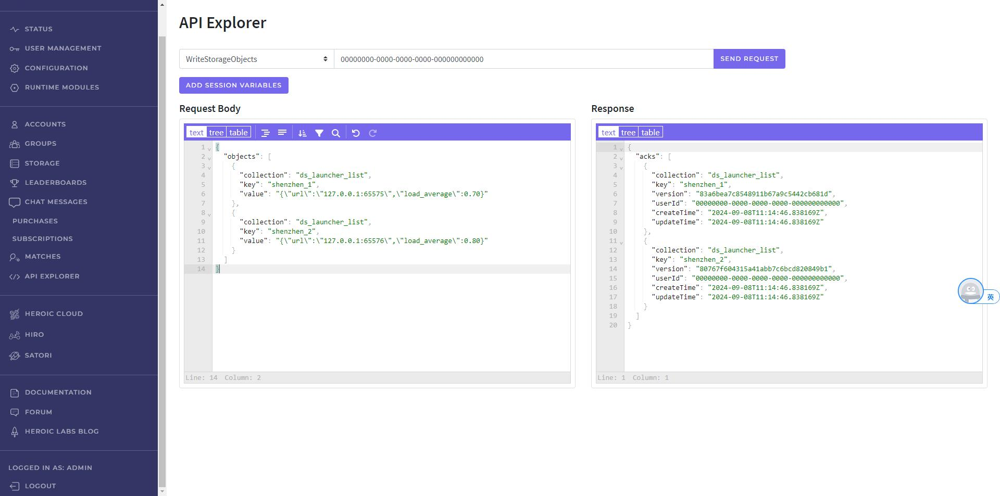
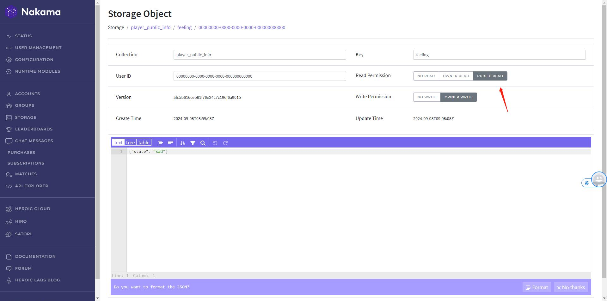
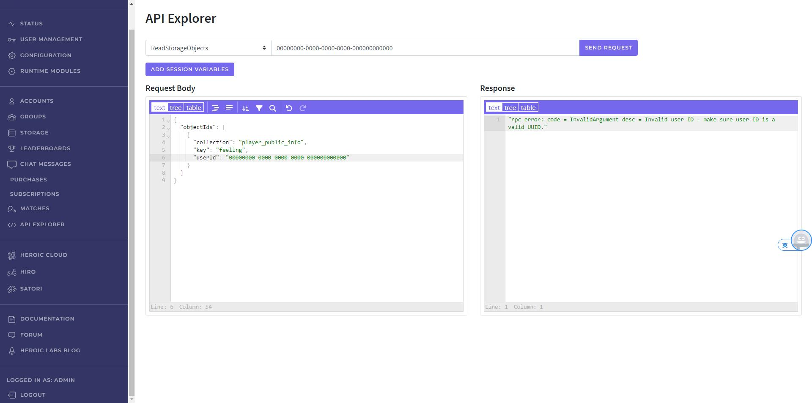
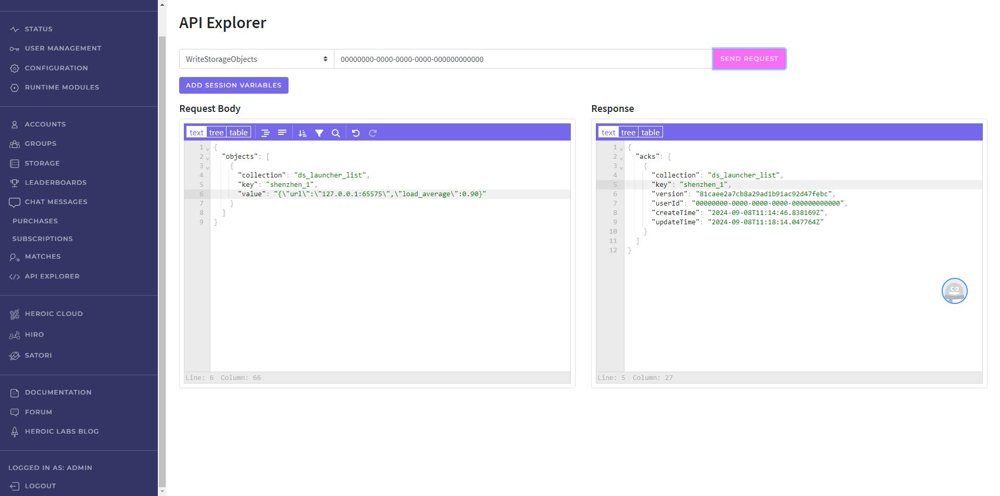
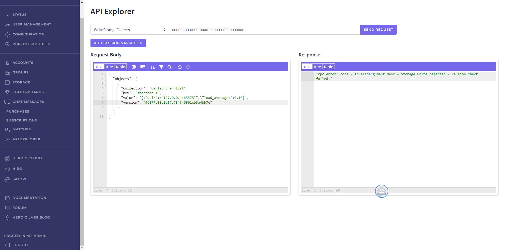
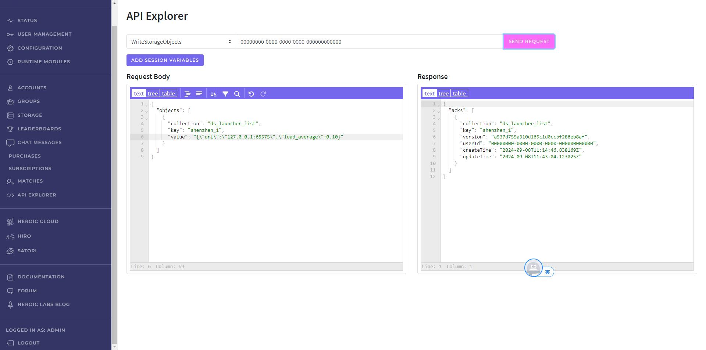

https://heroiclabs.com/docs/nakama/server-framework/lua-runtime/function-reference/#storage_read
https://heroiclabs.com/docs/nakama/server-framework/lua-runtime/function-reference/#storage_write

https://heroiclabs.com/docs/nakama/concepts/storage/collections/

### 1. 存储结构

官方文档介绍数据存储结构如下：

```
Collection
+---------------------------------------------------------------------+
|  Object                                                             |
|  +----------+------------+-------------+-----+-------------------+  |
|  | ?UserId? | Identifier | Permissions | ... |       Value       |  |
|  +---------------------------------------------------------------+  |
+---------------------------------------------------------------------+
```

一脸懵逼，还是用一个例子来解释吧。

要存储玩家的等级奖励领取状态，在使用NoSql数据库时，需要设计一个表，命名为`player_level_rewards_status`，结构如下：

|奖励等级   |玩家ID   |奖励领取状态 |
|---|---|---|
|reward_level   |player_id   |status|
|5   |4ec4f126-3f9d-11e7-84ef-b7c182b36521   |{"get":1,"timestamp":1725632295}|

Nakama存储引擎存储数据的结构和NoSql类似，在Nakama中：

`Collection = Table`

`Object = Row`

`Identifier = reward_level` 表示这一行要存储的数据键。

`Value = status` 表示存储的数据值。

`UserId = player_id` 用来标志这一行数据是哪个玩家的。

这样好理解多了。


### 2. 读写权限

Nakama的存储引擎是为了用户设计的，所以每一行数据都必须存储`UserId`，用来表示这行数据的拥有者。

并且还有一个字段`Permissions`存储当前这一条数据的读写权限。

```c++
/// 读权限
enum class NStoragePermissionRead
{
    NO_READ     = 0,  ///< 仅服务器脚本可以读取，客户端不可以读取
    OWNER_READ  = 1,  ///< 拥有者(UserId)可以读取
    PUBLIC_READ = 2   ///< 任意玩家可以读取
};

/// 写权限
enum class NStoragePermissionWrite
{
    NO_WRITE    = 0,  ///< 仅服务器脚本可以写入
    OWNER_WRITE = 1   ///< 拥有者(UserId)可以写入
};
```

客户端在写入一个Object时，无需设置Object的UserId字段，它就只能归属于当前用户，并且默认的`Permissions`也限定于当前用户读写。

如果你想这个数据，公开给其他玩家访问，可以指定读权限。

例如玩家设置了今天的心情，这个数据可以仅自己可见，也可以公开他人可见。

```c++
//设置今天的心情(feeling)为不开心，仅自己可见。
auto successCallback = [](const NStorageObjectAcks& acks)
{
    std::cout << "Successfully stored objects " << acks.size() << std::endl;
};

std::vector<NStorageObjectWrite> objects;

NStorageObjectWrite savesObject;
savesObject.collection = "player_public_info";
savesObject.key = "feeling";
savesObject.value = "sad";
objects.push_back(savesObject);

client->writeStorageObjects(session, objects, successCallback);
```

```c++
//设置今天的心情(feeling)为不开心，所有人可见
auto successCallback = [](const NStorageObjectAcks& acks)
{
    std::cout << "Successfully stored objects " << acks.size() << std::endl;
};

std::vector<NStorageObjectWrite> objects;

NStorageObjectWrite savesObject;
savesObject.collection = "player_public_info";
savesObject.key = "feeling";
savesObject.value = "sad";
savesObject.permissionRead = NStoragePermissionRead::PUBLIC_READ;//设置为所有人可见，其他玩家客户端也可以调用readStorageObjects来读取。
objects.push_back(savesObject);

client->writeStorageObjects(session, objects, successCallback);
```

客户端在读取数据时，需要指定`UserId`，如果`UserId`是自己，则可以读取自己所有数据。如果`UserId`是别人，则只能读取别人设置为公开权限的数据。

```c++
//读取当前用户的等级奖励领取状态数据
auto successCallback = [](const NStorageObjects& objects)
{
  for (auto& object : objects)
    {
        std::cout << "Object key: " << object.key << ", value: " << object.value << std::endl;
    }
};

std::vector<NReadStorageObjectId> objectIds;
NReadStorageObjectId objectId;
objectId.collection = "player_level_rewards_status";
objectId.key = "5";
objectId.userId = session->getUserId();
objectIds.push_back(objectId);
client->readStorageObjects(session, objectIds, successCallback);

//读取指定用户公开的心情
auto successCallback = [](const NStorageObjects& objects)
{
  for (auto& object : objects)
    {
        std::cout << "Object key: " << object.key << ", value: " << object.value << std::endl;
    }
};

std::vector<NReadStorageObjectId> objectIds;
NReadStorageObjectId objectId;
objectId.collection = "player_public_info";
objectId.key = "feeling";
objectId.userId = "4ec4f126-3f9d-11e7-84ef-b7c182b36521";
objectIds.push_back(objectId);
client->readStorageObjects(session, objectIds, successCallback);
```

而写权限，并不能公开，一条数据由你创建，就只能你写入，不能给其他玩家修改。

唯一例外的是服务器，在服务器脚本里可以读写任何用户创建的数据，服务器脚本拥有最高权限。

```lua
--读取指定玩家的等级奖励领取状态

local user_id = "4ec4f126-3f9d-11e7-84ef-b7c182b36521"

local object_ids = {
  { collection = "player_level_rewards_status", key = "5", user_id = user_id },--读取等级5的奖励领取状态
  { collection = "player_level_rewards_status", key = "10", user_id = user_id }--读取等级10的奖励领取状态
}

local objects = nk.storage_read(object_ids)

for _, r in ipairs(objects) do
  local message = string.format("read: %q, write: %q, value: %q", r.permission_read, r.permission_write, r.value)
  nk.logger_info(message)
end
```

```lua
--更新指定玩家的等级奖励领取状态

local user_id = "4ec4f126-3f9d-11e7-84ef-b7c182b36521"

local new_objects = {
  { collection = "player_level_rewards_status", key = "5", user_id = user_id, value = "{\"get\":1,\"timestamp\":1725632295}" },--更新
  { collection = "player_level_rewards_status", key = "10", user_id = user_id, value = "{\"get\":0}", permission_read = 1, permission_write = 1 }--更新并指定权限
}

nk.storage_write(new_objects)
```

### 3. 控制台查看修改数据

在Console里能查找修改用户的数据。



点击一条查看详细数据，可以进行修改保存。<font color=red>高危操作，需要添加二次授权功能！！</font>



### 4. 存储服务器数据

Nakama初始化后，会创建一个系统级账号`00000000-0000-0000-0000-000000000000`。



可以用这个账号来存储服务器的数据，使用方法就和普通用户一样，例如下图存储了DS Launcher列表。



那么系统账号的数据会不会有泄露的风险，如果系统账号的数据设置为公开，会怎么样？

在Console里将系统账号的一条数据读取权限修改为公开读取。



在Console去读取，会直接报错，Nakama判定系统账号为非法账号，说明系统账号数据只能通过服务器脚本读取，并不能通过Console或者客户端读取。



### 5. 更新数据

对一个Storage Object修改Value后再次写入，即可更新旧的Value。

例如下图更新了`shenzhen_1`这个DS Launcher的服务器负载为`0.9`。



### 6. 多版本并发控制

很多游戏数据都可能多个用户同时修改，同时读取，这涉及到多版本并发控制。

例如游戏公告，可能多个游戏管理员同时修改游戏公告，那么如何正确的将数据保存？

对程序员来说，一个最好的参考例子就是`git`，大型项目里经常遇到多人同时修改一个文件的情况。

前一秒你更新了代码文件到最新版本10。

然后在版本10上进行修改。

提交时`git`提示你本地版本太老，服务器已经是版本11了。

Nakama的Storage Engine也实现了类似的基于版本的并发控制。

每次写入Storage Object时，都会返回这一次写入的Version。

当你下次再想用这个Version写入时，服务器会检查当前最新Version和你传递过来的是否一致，如果不一致就拒绝。



不过在Nakama中，Version并不是强制需要，如果Version不指定，那么会直接更新，所以要自己具体情况来决定要不要使用Version进行并发控制。

