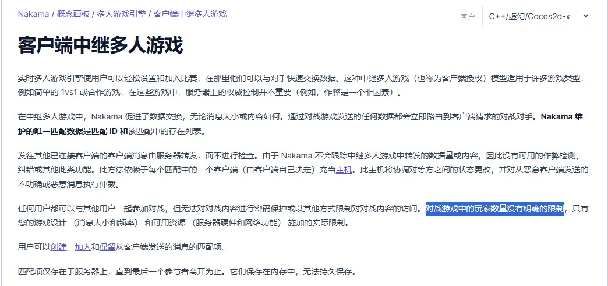
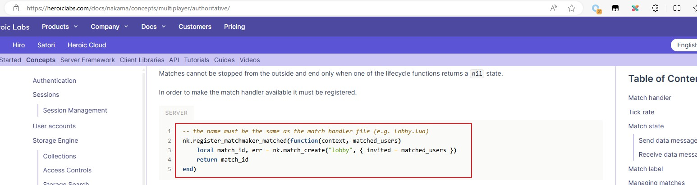

    https://heroiclabs.com/docs/nakama/concepts/multiplayer/matchmaker/

有点意外，客户端中继和服务器权威两种匹配模式。

首先是让玩家参与匹配

```c++
void UNakamaSubSystem::StartMatch()
{
	// 设置匹配成功的回调
	NakamaRealtimeClient->SetMatchmakerMatchedCallback( [&](const FNakamaMatchmakerMatched& MatchmakerMatched)
	{
		// Join Match by Token
		UE_LOG( LogNakamaSubSystem, Warning, TEXT( "Socket Matchmaker Matched, MatchId: %s" ), *MatchmakerMatched.MatchId );
		auto JoinMatchSuccessCallback = [this](const FNakamaMatch& Match)
		{
			UE_LOG(LogNakamaSubSystem, Display, TEXT("Joined Match. MatchId: %s"), *Match.MatchId);
		};

		auto JoinMatchErrorCallback = [this](const FNakamaRtError& Error)
		{
			UE_LOG(LogTemp, Warning, TEXT("Join Match Error. Message: %s"), *Error.Message);
		};
		
		NakamaRealtimeClient->JoinMatch(MatchmakerMatched.MatchId, {}, JoinMatchSuccessCallback, JoinMatchErrorCallback);
	});
	
	auto SuccessCallback = [&](const FNakamaMatchmakerTicket& Ticket)
	{
		UE_LOG(LogNakamaSubSystem, Display, TEXT("Added Matchmaker with Ticket: %s"), *Ticket.TicketId);

		//如果Ticket.TicketId是空的，说明匹配失败
	};

	auto ErrorCallback = [&](const FNakamaRtError& Error)
	{
		UE_LOG(LogNakamaSubSystem, Error, TEXT("Add Matchmaker. ErrorMessage: %s"), *Error.Message);
	};

	// Matchmaker Params
	// Note: Query: player_level >= 10 does not work. See: https://heroiclabs.com/docs/nakama/concepts/multiplayer/query-syntax/
	// Doing * instead
	TOptional<int32> MinCount = 2;
	TOptional<int32> MaxCount = 4;
	TOptional<FString> Query = FString("*");
	TMap<FString, FString> StringProperties;
	StringProperties.Add("region", "us");
	TMap<FString, double> NumericProperties;
	NumericProperties.Add("game_mode", 1);
	NumericProperties.Add("game_difficulty", 2);
	TOptional<int32> CountMultiple = 2;

	NakamaRealtimeClient->AddMatchmaker(MinCount, MaxCount, Query, StringProperties, NumericProperties, CountMultiple, SuccessCallback, ErrorCallback);
}
```

这一步`AddMatchmaker`两种匹配模式都是要先走的，让玩家先参与匹配。

然后就不一样了。

当其他玩家也参与进来，匹配成功之后，走到了`SetMatchmakerMatchedCallback`这里设置的匹配成功回调。

这里就开始区分了，像上面的代码，如果Server端不做任何处理，那么其实走的是客户端中继模式，匹配成功回调里会给一个`Token`，通过`Token`加入这一局。

但是代码里是错了，调用了`JoinMatch`，应该是调用`JoinMatchByToken`。

```c++
// 设置匹配成功的回调
NakamaRealtimeClient->SetMatchmakerMatchedCallback( [&](const FNakamaMatchmakerMatched& MatchmakerMatched)
{
    // Join Match by Token
    UE_LOG( LogNakamaSubSystem, Warning, TEXT( "Socket Matchmaker Matched, MatchId: %s" ), *MatchmakerMatched.MatchId );
    auto JoinMatchSuccessCallback = [this](const FNakamaMatch& Match)
    {
        UE_LOG(LogNakamaSubSystem, Display, TEXT("Joined Match. MatchId: %s"), *Match.MatchId);
    };

    auto JoinMatchErrorCallback = [this](const FNakamaRtError& Error)
    {
        UE_LOG(LogTemp, Warning, TEXT("Join Match Error. Message: %s"), *Error.Message);
    };
    
    // NakamaRealtimeClient->JoinMatch(MatchmakerMatched.MatchId, {}, JoinMatchSuccessCallback, JoinMatchErrorCallback);

    NakamaRealtimeClient->JoinMatchByToken(MatchmakerMatched.Token, JoinMatchSuccessCallback, JoinMatchErrorCallback);
});
```

什么是服务器权威模式？

    https://heroiclabs.com/docs/nakama/concepts/multiplayer/authoritative/

服务器你权威模式是，Nakama只帮你做匹配池子，匹配成功之后要自己去写Lua逻辑来创建一个对局，对局的具体规则要自己制定。

所以这个文档里大量的服务器Lua逻辑，就是为了实现对局。

相比而言客户端中继，其实就是Nakama做了匹配，然后给了一个Token，这个Token可以发给别人，别人客户端可以用这个Token调用`JoinMatchByToken`来加入对局。

那这里有个问题就是，怎么确保是匹配的人加入，禁止其他人随便加入？

确实不太行，中继模式没有人数限制。



还是要看看去实现服务器权威模式。

    https://heroiclabs.com/docs/nakama/concepts/multiplayer/authoritative/

逻辑大概是这样。

匹配成功后，Lua Hook创建一个Match，然后把MatchID通过回调下发到客户端。



然后客户端通过`JoinMatch`传入MatchID加入比赛。

```c++
NakamaRealtimeClient->JoinMatch(MatchmakerMatched.MatchId, {}, JoinMatchSuccessCallback, JoinMatchErrorCallback);
```

