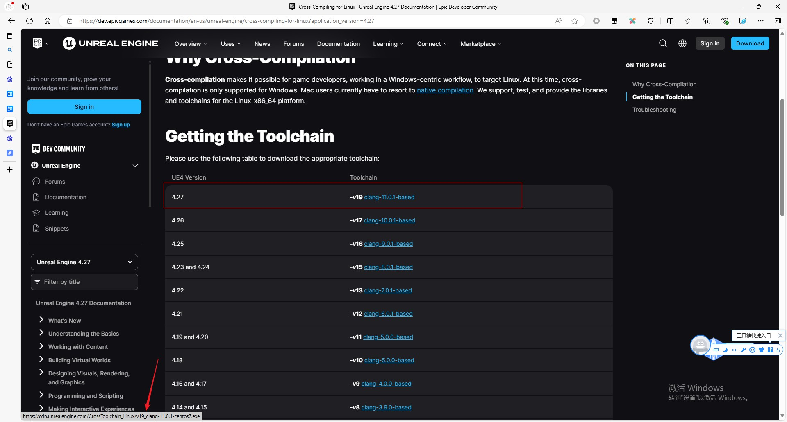

## 编译DS服务器

    本文参考知乎文章：
    https://zhuanlan.zhihu.com/p/515949803 
    https://zhuanlan.zhihu.com/p/277878434

### 1. 下载安装交叉编译工具链

参考官方文档：`https://dev.epicgames.com/documentation/en-us/unreal-engine/cross-compiling-for-linux?application_version=4.27`

因为是在Windows编译出Linux DS，所以要下载交叉编译工具Clang，下载地址：

    https://cdn.unrealengine.com/CrossToolchain_Linux/v19_clang-11.0.1-centos7.exe



我用的是UE4.27，挑选自己UE版本下载。

注意网页不要选择中文，中文的地址是错的。

下载好后开始安装


复制这个安装地址，我这里是 `C:\UnrealToolchains\v19_clang-11.0.1-centos7`

然后打开环境变量，看看系统变量里有没有一条叫`LINUX_MULTIARCH_ROOT`的，地址就是上面的安装地址，没有就自己加上。


### 2. 编译整个解决方案

直接编译整个解决方案。


### 3. 新增Target

新增一个DS的Target。


内容如下：

```c#
/// file:Source/ThirdPersonDemoServer.Target.cs

// Copyright Epic Games, Inc. All Rights Reserved.

using UnrealBuildTool;
using System.Collections.Generic;

public class ThirdPersonDemoServerTarget : TargetRules
{
	public ThirdPersonDemoServerTarget(TargetInfo Target) : base(Target)
	{
		Type = TargetType.Server;
		DefaultBuildSettings = BuildSettingsVersion.V2;
		ExtraModuleNames.Add("ThirdPersonDemo");
	}
}
```

然后重新生成Sln。

### 4. 测试编译Linux DS

测试编译Linux DS，看看交叉编译工具链是否安装OK。

选择编译目标为Linux Server。

<font color=red>注意：一定要安装完交叉编译工具链后，再次生成Sln，才有Linux选项</font>


然后直接编译游戏项目。


因为Clang和VC的差异，所以中间有些报错自己解决一下。

编译好了之后，在`Binaries\Linux`中。


### 5. 打包Linux DS及资源


### 6. 在WSL中运行DS

先在WSL中用`ifconfig`命令查看IP地址，然后执行`ThirdPersonDemoServer.sh`启动DS。


然后用`.\nc -u 172.18.95.176 7777`来测试DS连通性。


