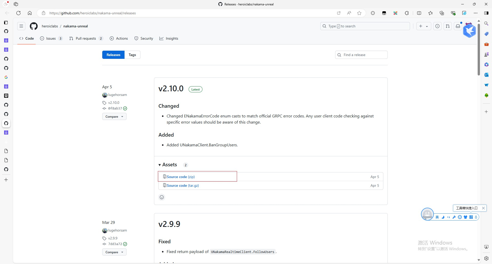
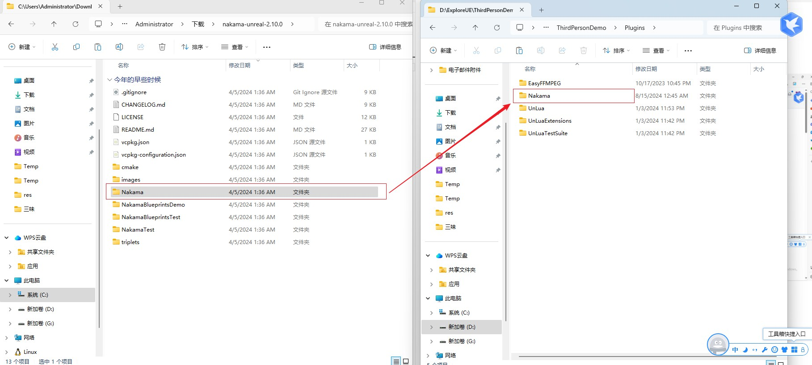

## Nakama集成到UE中

Nakama UE插件最低支持UE4.24版本。

### 1. 下载插件

Nakama UE插件下载：`https://github.com/heroiclabs/nakama-unreal/releases`



解压后复制`Nakama`文件夹到UE项目的`Plugins`目录，如果你的项目没有这个目录，就新建一个。



### 2. 集成插件

在`.uproject`文件中启用插件。

```json
{
	"FileVersion": 3,
	"EngineAssociation": "{4314FD6A-439D-D1F7-1520-7F8FCA2835FF}",
	"Category": "",
	"Description": "",
	"Modules": [
		{
			"Name": "ThirdPersonDemo",
			"Type": "Runtime",
			"LoadingPhase": "Default",
			"AdditionalDependencies": [
				"Engine",
				"UMG",
				"NetCore",
				"SlateCore"
			]
		}
	],
	"Plugins": [
		{
			"Name": "RenderDocPlugin",
			"Enabled": true
		},
		{
			"Name": "DatasmithFBXImporter",
			"Enabled": true
		},
		{
			"Name": "Nakama",
			"Enabled": true
		}
	]
}
```

在你项目的`Build.cs`文件中添加依赖。

```cs
///file:<ProjectDir>\Source\ThirdPersonDemo\ThirdPersonDemo.Build.cs

PrivateDependencyModuleNames.AddRange(new string[] { "NakamaUnreal" });
```

打开`Plugins/Nakama/Source/NakamaTests/Public/NakamaTestBase.h`进行以下修改。

```c++
double Timeout = 60.0;
修改为
float Timeout = 60.0;
```

```c++
double GetTimeout;
修改为
float GetTimeout;
```

然后右键`.uproject`重新生成Sln，然后编译。

### 3. 接入Nakama

创建一个类`UNakamaActor`继承自`UActor`，然后编译，创建一个蓝图，拖到场景里。


```c++
///file:NakamaActor.h

#pragma once

#include "CoreMinimal.h"
#include "GameFramework/Actor.h"
#include "NakamaClient.h"
#include "NakamaActor.generated.h"

UCLASS()
class THIRDPERSONDEMO_API ANakamaActor : public AActor
{
	GENERATED_BODY()
	
public:	
	// Sets default values for this actor's properties
	ANakamaActor();

protected:
	// Called when the game starts or when spawned
	virtual void BeginPlay() override;

public:	
	// Called every frame
	virtual void Tick(float DeltaTime) override;

public:
	//Nakama账号验证成功回调
	UFUNCTION()
	void OnAuthenticationSuccess(UNakamaSession* LoginData);

	//Nakama账号验证失败回调
	UFUNCTION()
	void OnAuthenticationError(const FNakamaError& Error);

	//实时客户端连接成功回调
	UFUNCTION()
	void OnRealtimeClientConnectSuccess();

	//实时客户端连接失败回调
	UFUNCTION()
	void OnRealtimeClientConnectError(const FNakamaRtError& ErrorData);

public:
	//Nakama客户端
	UPROPERTY()
	UNakamaClient* NakamaClient;

	//Nakama实时客户端，用于实时通信，比如聊天
	UPROPERTY()
	UNakamaRealtimeClient* NakamaRealtimeClient;

	//Nakama用户会话,用于验证,获取用户信息,获取好友列表等
	UPROPERTY()
	UNakamaSession* UserSession;
};
```

```c++
///file:NakamaActor.cpp

#include "NakamaActor.h"


// Sets default values
ANakamaActor::ANakamaActor()
{
 	// Set this actor to call Tick() every frame.  You can turn this off to improve performance if you don't need it.
	PrimaryActorTick.bCanEverTick = true;

}

// Called when the game starts or when spawned
void ANakamaActor::BeginPlay()
{
	Super::BeginPlay();

	// Default Client Parameters
	FString ServerKey = TEXT("defaultkey");
	FString Host = TEXT("127.0.0.1");
	int32 Port = 7350;
	bool bUseSSL = false;
	bool bEnableDebug = true;

	// Setup Default Client
	NakamaClient = UNakamaClient::CreateDefaultClient(ServerKey, Host, Port, bUseSSL, bEnableDebug);

	// Authentication Parameters
	FString Email = TEXT("debug@mail.com");
	FString Password = TEXT("verysecretpassword");
	FString Username = TEXT("debug-user");
	TMap<FString, FString> Variables;

	// Setup Delegates of same type and bind them to local functions
	FOnAuthUpdate AuthenticationSuccessDelegate;
	AuthenticationSuccessDelegate.AddDynamic(this, &ANakamaActor::OnAuthenticationSuccess);

	FOnError AuthenticationErrorDelegate;
	AuthenticationErrorDelegate.AddDynamic(this, &ANakamaActor::OnAuthenticationError);

	NakamaClient->AuthenticateEmail(Email, Password, Username, true, Variables, AuthenticationSuccessDelegate, AuthenticationErrorDelegate);
}

// Called every frame
void ANakamaActor::Tick(float DeltaTime)
{
	Super::Tick(DeltaTime);

}

void ANakamaActor::OnAuthenticationSuccess(UNakamaSession* LoginData)
{
	if(GEngine) GEngine->AddOnScreenDebugMessage(-1, 15.0f, FColor::Green, FString::Printf(TEXT("Authenticated As %s"), *LoginData->SessionData.Username));

	UserSession = LoginData;

	// Setup Delegates of same type and bind them to local functions
	FOnRealtimeClientConnected ConnectionSuccessDelegate;
	ConnectionSuccessDelegate.AddDynamic(this, &ANakamaActor::OnRealtimeClientConnectSuccess);

	FOnRealtimeClientConnectionError ConnectionErrorDelegate;
	ConnectionErrorDelegate.AddDynamic(this, &ANakamaActor::OnRealtimeClientConnectError);

	// This is our realtime client (socket) ready to use
	NakamaRealtimeClient = NakamaClient->SetupRealtimeClient();

	// Remember to Connect
	bool bCreateStatus = true;
	NakamaRealtimeClient->Connect(UserSession, bCreateStatus, ConnectionSuccessDelegate, ConnectionErrorDelegate);

}

void ANakamaActor::OnAuthenticationError(const FNakamaError& Error)
{
	if(GEngine) GEngine->AddOnScreenDebugMessage(-1, 15.0f, FColor::Red, FString::Printf(TEXT("Failed to Authenticate: %s"), *Error.Message));
}

void ANakamaActor::OnRealtimeClientConnectSuccess()
{
	if(GEngine) GEngine->AddOnScreenDebugMessage(-1, 15.0f, FColor::Green, FString(TEXT("Socket Setup Success!")));

	// Example of Joining Chat without callbacks
	NakamaRealtimeClient->JoinChat("Heroes", ENakamaChannelType::ROOM, true, false, {}, {});

}

void ANakamaActor::OnRealtimeClientConnectError(const FNakamaRtError& ErrorData)
{
	if(GEngine) GEngine->AddOnScreenDebugMessage(-1, 15.0f, FColor::Red, FString(TEXT("Socket Setup Failed!")));
}
```

### 4. 测试

启动Nakama服务器，UE编辑器Play。

